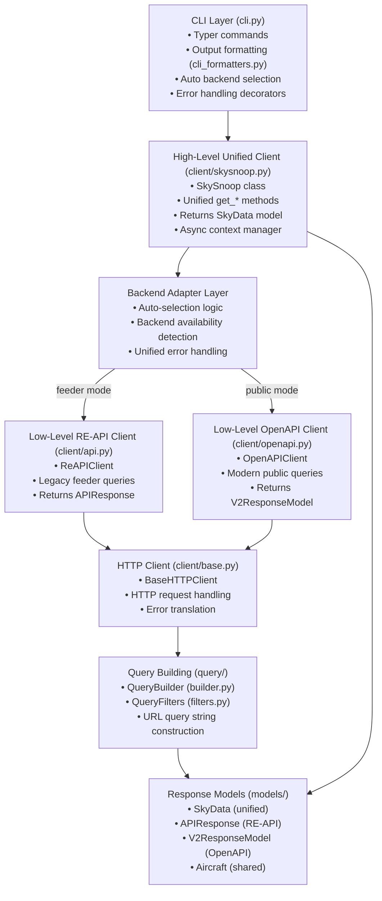
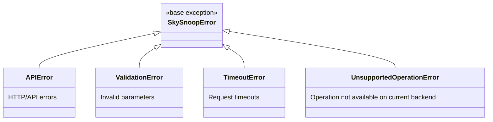
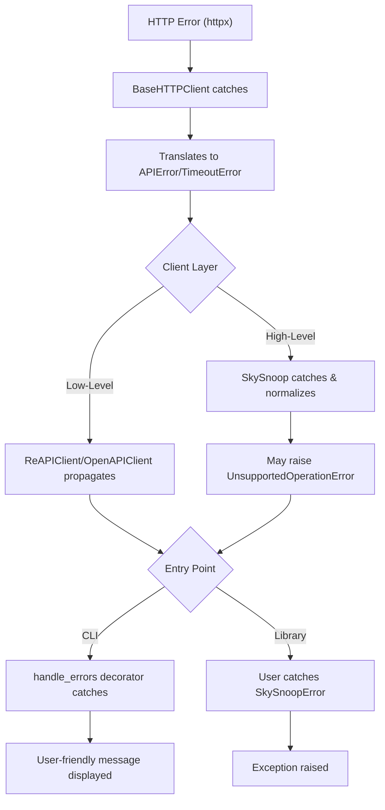

# Architecture Documentation

This document describes the architecture and design of the skysnoop SDK.

## Overview

The skysnoop SDK is organized into three layers with an adapter pattern for backend flexibility:

**Architecture Principles**:

- **Unified Interface**: SkySnoop client provides a single interface for all operations
- **Backend Abstraction**: Automatic selection between RE-API and OpenAPI backends
- **Normalized Responses**: All backends return unified SkyData model
- **Type Safety**: Comprehensive typing with Pydantic validation
- **Async-First**: All I/O operations use async/await
- **Testability**: Each layer can be tested in isolation



## Component Descriptions

### CLI Layer

**Location**: `skysnoop/cli.py`, `skysnoop/cli_formatters.py`

**Purpose**: Provides command-line interface for end users.

**Key Components**:

- **Commands**: Each API query type has a corresponding Typer command
- **Backend Selection**: Auto-selects between RE-API (feeder) and OpenAPI (public) by default
- **Decorators**:
  - `@syncify` - Converts async functions to sync for Typer
  - `@handle_errors` - Catches exceptions and displays user-friendly messages
- **Formatters**: Rich table output, JSON output, and compact output

**Design Decisions**:

- Used Rich library for beautiful terminal tables
- All commands support `--json` flag for machine-readable output
- Filter options are consistent across all applicable commands
- Error messages include helpful suggestions
- CLI defaults to "auto" backend for intelligent selection
- Users can override backend with `--backend` option

### High-Level Unified Client (SkySnoop)

**Location**: `skysnoop/client/skysnoop.py`

**Purpose**: Provides a unified, developer-friendly interface to the adsb.lol API that abstracts backend complexity.

**Key Features**:

- **Automatic Backend Selection**: Detects feeder vs public environment and chooses appropriate backend
- **Unified Response Model**: All methods return `SkyData` regardless of backend
- **Normalized Interface**: Same method signatures across all backends
- **Smart Fallbacks**: Gracefully handles unsupported operations
- **Type Safety**: Full type hints and Pydantic validation

**Class**: `SkySnoop`

**Methods**:

- `get_in_circle(lat, lon, radius, filters)`: Query aircraft in circle
- `get_closest(lat, lon, filters)`: Find closest aircraft
- `get_in_box(min_lat, min_lon, max_lat, max_lon, filters)`: Query aircraft in bounding box
- `get_by_hex(hex_code)`: Lookup aircraft by ICAO hex
- `get_by_callsign(callsign, filters)`: Find aircraft by callsign
- `get_by_registration(registration, filters)`: Find aircraft by registration
- `get_by_type(aircraft_type, filters)`: Find aircraft by type code
- `get_all(filters)`: Get all aircraft with position data

**Design Decisions**:

- Returns consistent `SkyData` model regardless of backend
- Automatically normalizes data from backend-specific models
- Raises `UnsupportedOperationError` for operations not available on current backend
- Async context manager ensures proper resource cleanup
- Uses dependency injection for backend selection (testable)

### Low-Level API Clients

**Locations**:

- **ReAPIClient**: `skysnoop/client/api.py`
- **OpenAPIClient**: `skysnoop/client/openapi.py`

**Purpose**: Provide direct access to backend-specific APIs for advanced use cases. Most developers should use the high-level `SkySnoop` client instead.

**ReAPIClient**:

- Geographic queries: `circle()`, `closest()`, `box()`
- Identifier queries: `find_hex()`, `find_callsign()`, `find_reg()`, `find_type()`
- Bulk queries: `all()`, `all_with_pos()`
- Returns backend-specific `APIResponse` model

**OpenAPIClient**:

- Hex lookup: `v2_hex(hex_code)`
- Callsign lookup: `v2_callsign(callsign)`
- Returns backend-specific `V2ResponseModel` model

**Design Decisions**:

- Async-first design using httpx
- Context manager pattern ensures proper resource cleanup
- Delegates query string construction to QueryBuilder
- Delegates HTTP operations to BaseHTTPClient
- Returns backend-specific typed response objects (not unified `SkyData`)
- Used by `SkySnoop` adapter layer internally
- Exposed for advanced users who need backend-specific features

### HTTP Client

**Location**: `skysnoop/client/base.py`

**Purpose**: Handles low-level HTTP communication with the API.

**Key Components**:

- **BaseHTTPClient**: Wraps httpx.AsyncClient
- **Error Translation**: Converts httpx exceptions to custom exceptions
- **URL Construction**: Builds full URLs from query strings

**Design Decisions**:

- Manual URL construction to preserve commas (critical for API)
- httpx chosen for async support and modern API
- Converts JSON responses to Pydantic models
- Timeout and base URL are configurable

**Critical Implementation Detail**:
The API requires commas in query parameters (e.g., `circle=37.7,-122.4,50`). Using httpx's `params` dict would URL-encode commas to `%2C`, breaking the API. Therefore, we:

1. Build query strings manually in QueryBuilder
2. Concatenate with base URL using f-strings
3. Never use httpx's `params` parameter

### Query Building

**Location**: `skysnoop/query/builder.py`, `skysnoop/query/filters.py`

**Purpose**: Constructs URL query strings for API requests.

**Key Components**:

- **QueryBuilder**: Static methods that build query strings
- **QueryFilters**: Pydantic model for filter parameters with validation

**Design Decisions**:

- Builder returns strings, not dicts, to avoid URL encoding
- Filters use Pydantic for validation (e.g., altitude range checks)
- Mutual exclusion enforced for conflicting filters
- Boolean filters use "true"/"false" strings (not "1"/"0")

**Example Flow**:

```python
# 1. Create filters
filters = QueryFilters(above_alt_baro=30000, type_code="A321")

# 2. Build query string
query = QueryBuilder.build_circle(
    lat=37.7749,
    lon=-122.4194,
    radius=200,
    filters=filters
)
# Result: "circle=37.7749,-122.4194,200&filter_above_alt_baro=30000&filter_type=A321"

# 3. Send request
response = await http_client.get(query)
```

### Data Models

**Location**: `skysnoop/models/aircraft.py`, `skysnoop/models/response.py`, `skysnoop/models/openapi/`

**Purpose**: Type-safe data structures for API responses.

**Unified Model** (recommended for application code):

- **SkyData**: Normalized response model returned by `SkySnoop` client
  - Consistent structure regardless of backend
  - Contains list of `Aircraft` objects
  - Includes metadata (`aircraft_count`, `timestamp`)

**Backend-Specific Models** (for advanced use):

- **APIResponse**: RE-API response wrapper with `resultCount` and `aircraft` list
- **V2ResponseModel**: OpenAPI v2 response with `ac` array
- **Aircraft**: Individual aircraft telemetry (60+ fields), shared across backends

**Design Decisions**:

- Pydantic models for validation and serialization
- Forward compatibility with `extra="allow"`
- Altitude can be int or "ground" literal (special handling)
- Properties for computed values (e.g., `has_position`)
- Rich string representations for debugging
- `SkyData` normalizes differences between backend response formats

### Exception Hierarchy

**Location**: `skysnoop/exceptions.py`

**Purpose**: Custom exceptions for clear error handling.

**Hierarchy**:



**Design Decisions**:

- All custom exceptions inherit from `SkySnoopError` (previously `ADSBLolError`)
- Allows catching all library errors with single except block
- Specific exceptions for different error types
- httpx exceptions translated to custom exceptions
- `UnsupportedOperationError` raised when backend doesn't support requested operation

## Data Flow

### Typical Query Flow (High-Level Client)

1. **User initiates query** (CLI or library)

   ```python
   # CLI: skysnoop circle -- 37.7749 -122.4194 50
   # Library: await client.get_in_circle(lat=37.7749, lon=-122.4194, radius=50)
   ```

2. **SkySnoop client method called**
   - Determines appropriate backend (auto/reapi/openapi)
   - Creates backend-specific client instance

3. **Backend adapter executes query**
   - For RE-API: `ReAPIClient.circle()`
   - For OpenAPI: `OpenAPIClient.v2_hex()` or other method
   - Backend constructs query via QueryBuilder
   - HTTP request sent via BaseHTTPClient

4. **Backend response received**
   - RE-API returns `APIResponse`
   - OpenAPI returns `V2ResponseModel`

5. **Response normalized**
   - SkySnoop converts backend response to `SkyData`
   - All aircraft models unified
   - Metadata normalized (count, timestamp)

6. **Result returned**
   - CLI formats `SkyData` and displays
   - Library returns unified `SkyData` model

### Low-Level Query Flow (Advanced)

For direct backend access:

1. User creates `ReAPIClient` or `OpenAPIClient` directly
2. Calls backend-specific method (e.g., `circle()`, `v2_hex()`)
3. QueryBuilder constructs query string
4. BaseHTTPClient sends HTTP request
5. Backend-specific response model returned (`APIResponse` or `V2ResponseModel`)
6. User handles backend-specific response format

### Error Handling Flow



## Testing Strategy

See [testing.md](testing.md) for comprehensive testing documentation.

## Configuration

**Location**: `adsblol/settings.py`, `adsblol/conf/settings.py`

**Configurable Settings**:

- `adsb_api_base_url`: API base URL (default: <https://re-api.adsb.lol/>)
- `adsb_api_timeout`: Request timeout in seconds (default: 30.0)
- `cli_output_format`: Default CLI output format (default: "table")

**Configuration Methods**:

1. Environment variables (e.g., `ADSB_API_BASE_URL`)
2. Direct settings object modification
3. Client constructor parameters (overrides settings)

## Design Patterns

### Async Context Manager

Used in:

- `ReAPIClient`
- `BaseHTTPClient`

Benefits:

- Automatic resource cleanup
- Clear lifecycle management
- Pythonic API

### Builder Pattern

Used in:

- `QueryBuilder`

Benefits:

- Separates query construction from execution
- Centralized query string logic
- Easy to test independently

### Decorator Pattern

Used in:

- `@syncify` for async-to-sync conversion
- `@handle_errors` for CLI error handling

Benefits:

- Reusable functionality
- Clean separation of concerns
- DRY principle

### Pydantic Models

Used throughout for data validation.

Benefits:

- Runtime validation
- Type safety
- Automatic serialization/deserialization
- Forward compatibility

## Adding New Features

### Adding a New Query Type to High-Level Client

1. **Add method to SkySnoop**:

   ```python
   async def get_new_query(
       self,
       param1: str,
       param2: int,
       filters: QueryFilters | None = None,
   ) -> SkyData:
       """Query aircraft using new query type.

       This method automatically uses the appropriate backend.
       """
       if self.backend == "openapi":
           # If OpenAPI supports this operation
           response = await self._openapi_client.v2_new_query(param1, param2)
           # Normalize to SkyData
           return self._normalize_openapi_response(response)
       elif self.backend in ("reapi", "auto"):
           # RE-API implementation
           response = await self._reapi_client.new_query(param1, param2, filters)
           # Normalize to SkyData
           return self._normalize_reapi_response(response)
       else:
           raise UnsupportedOperationError(f"new_query not supported on backend: {self.backend}")
   ```

2. **Add method to appropriate low-level client** (if not already present):

   For ReAPIClient:

   ```python
   async def new_query(
       self,
       param1: str,
       param2: int,
       filters: QueryFilters | None = None,
   ) -> APIResponse:
       """Description of new query.

       Args:
           param1: Description
           param2: Description
           filters: Optional filter criteria

       Returns:
           APIResponse with matching aircraft
       """
       self._ensure_client()
       query = QueryBuilder.build_new_query(param1, param2, filters)
       return await self._http_client.get(query)
   ```

3. **Add QueryBuilder method** (if needed for RE-API):

   ```python
   @staticmethod
   def build_new_query(param1: str, param2: int, filters: QueryFilters | None = None) -> str:
       query = f"new_query={param1},{param2}"
       if filters:
           filter_string = filters.to_query_string()
           if filter_string:
               query = f"{query}&{filter_string}"
       return query
   ```

4. **Add CLI command**:

    ```python
    @app.command(help="Description of new query")
    @handle_errors
    @syncify
    async def new_query(
        param1: str = typer.Argument(..., help="Description"),
        param2: int = typer.Argument(..., help="Description"),
        # ... filter options ...
        backend: BackendChoice = typer.Option("auto", "--backend", help="Backend selection"),
        json_output: bool = typer.Option(False, "--json", help="Output as JSON"),
    ):
        filters = _build_filters(...)
        client = get_client_for_backend(backend)
        async with client:
            response = await client.get_new_query(param1, param2, filters)
        format_output(response, format_type="json" if json_output else settings.cli_output_format)
    ```

5. **Add tests** (see testing.md)

### Adding a New Filter

1. **Add field to QueryFilters**:

   ```python
   class QueryFilters(BaseModel):
       # ... existing fields ...
       new_filter: str | None = Field(None, description="Description")
   ```

2. **Add to query params conversion**:

   ```python
   def to_query_params(self) -> dict[str, str]:
       params: dict[str, str] = {}
       # ... existing conversions ...
       if self.new_filter is not None:
           params["filter_new"] = self.new_filter
       return params
   ```

3. **Add CLI option to applicable commands**:

   ```python
   new_filter: Optional[str] = typer.Option(None, "--new-filter", help="Description")
   ```

4. **Update _build_filters helper**:

   ```python
   filter_params = {
       # ... existing params ...
       "new_filter": new_filter,
   }
   ```

## Performance Considerations

- **Async/Await**: All I/O operations are async for high concurrency
- **Connection Pooling**: httpx AsyncClient pools connections automatically
- **No Caching**: API data changes rapidly, so no caching is implemented
- **Lazy Evaluation**: Models use Pydantic's lazy validation where possible

## Security Considerations

- **No Sensitive Data**: API requires no authentication
- **Input Validation**: Pydantic validates all input parameters
- **Safe Defaults**: Reasonable timeouts prevent hanging
- **No SQL Injection**: Not applicable (REST API, not database)
- **URL Encoding**: Manual construction avoids encoding issues
