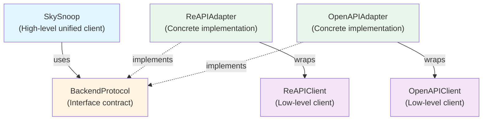

# Backend Protocol and Adapter Pattern

This document explains the backend protocol architecture that normalizes different API backends for the SkySnoop unified client, and provides step-by-step instructions for adding new backends or API services.

## Table of Contents

- [Overview](#overview)
- [Architecture](#architecture)
- [The BackendProtocol Contract](#the-backendprotocol-contract)
- [Response Normalization](#response-normalization)
- [Existing Implementations](#existing-implementations)
- [Adding a New Backend](#adding-a-new-backend)
- [Testing Your Adapter](#testing-your-adapter)
- [Backend Selection Logic](#backend-selection-logic)
- [Best Practices](#best-practices)
- [Common Pitfalls](#common-pitfalls)

## Overview

The SkySnoop unified client uses an **adapter pattern** to support multiple backend APIs (RE-API and OpenAPI) through a consistent interface. This architecture allows:

- **Unified Interface**: Users interact with a single `SkySnoop` client regardless of backend
- **Backend Abstraction**: Implementation details hidden behind protocol interface
- **Type Safety**: Protocol-based structural subtyping ensures compile-time guarantees
- **Extensibility**: New backends can be added without modifying existing code
- **Response Normalization**: All backends return the same `SkyData` model

### Key Components



## Architecture

### Design Principles

1. **Protocol-Based**: Uses Python's `Protocol` for structural subtyping (not inheritance)
2. **Async Context Managers**: All adapters support `async with` for resource management
3. **Normalized Responses**: All adapters return `SkyData` (not backend-specific models)
4. **Error Handling**: Adapters translate backend-specific errors to common exceptions
5. **Filter Support**: `QueryFilters` passed through to backends (when supported)

### File Structure

```
skysnoop/
├── client/
│   ├── protocol.py              # BackendProtocol definition
│   ├── skysnoop.py              # SkySnoop unified client
│   ├── backend_selection.py     # Auto-selection logic
│   ├── adapters/
│   │   ├── reapi_adapter.py     # RE-API adapter implementation
│   │   └── openapi_adapter.py   # OpenAPI adapter implementation
│   ├── api.py                   # ReAPIClient (low-level)
│   └── openapi.py               # OpenAPIClient (low-level)
├── models/
│   ├── skydata.py               # Unified response model
│   ├── aircraft.py              # Common Aircraft model
│   └── response.py              # Backend-specific models
└── exceptions.py                # Common exception types
```

## The BackendProtocol Contract

**Location**: `skysnoop/client/protocol.py`

The `BackendProtocol` defines the interface that all backend adapters must implement. It uses Python's `Protocol` class for structural subtyping, which means adapters don't need to explicitly inherit from it—they just need to implement the required methods.

### Required Methods

All methods are **async** and return **`SkyData`** instances:

#### Identifier Queries

```python
async def get_by_hex(self, hex_code: str) -> SkyData:
    """Get aircraft by ICAO hex code."""
    ...

async def get_by_callsign(self, callsign: str) -> SkyData:
    """Get aircraft by callsign/flight number."""
    ...

async def get_by_registration(self, registration: str) -> SkyData:
    """Get aircraft by registration (tail number)."""
    ...

async def get_by_type(self, aircraft_type: str) -> SkyData:
    """Get aircraft by type designator (e.g., 'B738')."""
    ...
```

#### Geographic Queries

```python
async def get_in_circle(
    self,
    lat: float,
    lon: float,
    radius: float,
    filters: QueryFilters | None = None,
) -> SkyData:
    """Get aircraft within circular area."""
    ...

async def get_closest(
    self,
    lat: float,
    lon: float,
    radius: float,
    filters: QueryFilters | None = None,
) -> SkyData:
    """Find closest aircraft to a point."""
    ...

async def get_in_box(
    self,
    lat_south: float,
    lat_north: float,
    lon_west: float,
    lon_east: float,
    filters: QueryFilters | None = None,
) -> SkyData:
    """Get aircraft within rectangular bounding box."""
    ...
```

#### Bulk Queries

```python
async def get_all_with_pos(self, filters: QueryFilters | None = None) -> SkyData:
    """Get all aircraft with position data.

    Note: Backends may raise UnsupportedOperationError if they cannot
    fulfill this request due to radius limitations.
    """
    ...

async def get_all(self, filters: QueryFilters | None = None) -> SkyData:
    """Get all tracked aircraft (with or without position).

    Note: Backends may raise UnsupportedOperationError if they cannot
    fulfill this request due to radius limitations.
    """
    ...
```

#### Context Manager Protocol

```python
async def __aenter__(self) -> Self:
    """Enter async context manager - initialize resources."""
    ...

async def __aexit__(self, exc_type, exc_val, exc_tb) -> None:
    """Exit async context manager - cleanup resources."""
    ...
```

### Design Decisions

#### Why Protocol Instead of ABC?

```python
# ❌ Don't use inheritance (rigid, requires explicit subclassing)
class BackendAdapter(ABC):
    @abstractmethod
    async def get_by_hex(self, hex_code: str) -> SkyData: ...

# ✅ Use Protocol (flexible, structural subtyping)
class BackendProtocol(Protocol):
    async def get_by_hex(self, hex_code: str) -> SkyData: ...
```

**Benefits of Protocol**:

- No explicit inheritance required
- Duck typing with type safety
- Easier to test and mock
- More Pythonic approach

#### Why SkyData Instead of Backend-Specific Types?

All adapters return `SkyData` (not `APIResponse` or `V2ResponseModel`) because:

1. **Consistent Interface**: Users see the same response structure regardless of backend
2. **Backend Independence**: Users don't need to know which backend they're using
3. **Simplified Logic**: No type checking or casting required in user code
4. **Future-Proof**: New backends can be added without changing user code

## Response Normalization

### SkyData Model

**Location**: `skysnoop/models/skydata.py`

The `SkyData` model is the unified response structure that normalizes differences between backend APIs:

```python
class SkyData(BaseModel):
    """Unified response model for all backends."""

    timestamp: float              # Server timestamp (seconds since epoch)
    result_count: int             # Number of aircraft in response
    processing_time: float | None # Processing time in ms (RE-API only)
    aircraft: list[Aircraft]      # List of Aircraft objects
    backend: Literal["openapi", "reapi"]  # Backend source
    simulated: bool = False       # Whether operation was simulated
```

### Field Mapping

Different backends use different field names. Adapters must normalize these:

| SkyData Field | RE-API Source | OpenAPI Source |
|---------------|---------------|----------------|
| `timestamp` | `now` | `now` |
| `result_count` | `resultCount` | `total` |
| `processing_time` | `ptime` | `None` (not provided) |
| `aircraft` | `aircraft` (already `Aircraft`) | `ac` (requires conversion) |
| `backend` | `"reapi"` (set by adapter) | `"openapi"` (set by adapter) |
| `simulated` | `False` (native ops) | `True` (for simulated ops) |

### Aircraft Model Normalization

The `Aircraft` model is shared across backends, but field names differ:

```python
# OpenAPI uses short field names
{
    "r": "N12345",   # registration
    "t": "B738",     # type
    "hex": "abc123"
}

# RE-API uses full field names
{
    "registration": "N12345",
    "type": "B738",
    "hex": "abc123"
}
```

Adapters must convert backend-specific aircraft data to the common `Aircraft` model:

```python
# Example from OpenAPIAdapter
def _convert_aircraft(self, v2_aircraft: V2ResponseAcItem) -> Aircraft:
    """Convert OpenAPI aircraft to common Aircraft model."""
    return Aircraft(
        hex=v2_aircraft.hex,
        registration=v2_aircraft.r,      # Map 'r' → 'registration'
        type=v2_aircraft.t,              # Map 't' → 'type'
        flight=v2_aircraft.flight,
        # ... all other fields
    )
```

## Existing Implementations

### ReAPIAdapter

**Location**: `skysnoop/client/adapters/reapi_adapter.py`

The RE-API adapter wraps `ReAPIClient` and provides **native support** for all operations.

**Characteristics**:

- ✅ Native operations (no simulation)
- ✅ Full `QueryFilters` support
- ✅ Provides `processing_time`
- ✅ Box queries natively supported
- ✅ Bulk queries supported (with radius limits)
- ❌ Requires feeder access (not publicly accessible)

**Key Implementation Details**:

```python
class ReAPIAdapter:
    """Adapter for ReAPIClient."""

    def __init__(self, base_url: str | None = None, timeout: float = 30.0):
        if base_url is None:
            base_url = "https://re-api.adsb.lol"
        self._client = ReAPIClient(base_url=base_url, timeout=timeout)

    def _convert_api_response(
        self,
        api_response: APIResponse,
        simulated: bool = False
    ) -> SkyData:
        """Convert APIResponse to SkyData."""
        return SkyData(
            timestamp=api_response.now,
            result_count=api_response.resultCount,
            processing_time=api_response.ptime,
            aircraft=api_response.aircraft,  # Already Aircraft instances
            backend="reapi",
            simulated=simulated,
        )

    async def get_by_hex(self, hex_code: str) -> SkyData:
        """Native implementation using RE-API."""
        api_response = await self._client.find_hex(hex_code)
        return self._convert_api_response(api_response)
```

### OpenAPIAdapter

**Location**: `skysnoop/client/adapters/openapi_adapter.py`

The OpenAPI adapter wraps `OpenAPIClient` and **simulates** some operations.

**Characteristics**:

- ✅ Public access (no feeder required)
- ✅ Native identifier queries
- ✅ API key support (future compatibility)
- ⚠️ Simulates geographic queries (circle, closest, box)
- ⚠️ Limited `QueryFilters` support (military only)
- ❌ Does not provide `processing_time`
- ❌ Bulk queries unsupported (raises `UnsupportedOperationError`)

**Simulation Strategy**:

For operations not natively supported by OpenAPI, the adapter simulates them:

```python
async def get_in_circle(
    self,
    lat: float,
    lon: float,
    radius: float,
    filters: QueryFilters | None = None,
) -> SkyData:
    """Simulated implementation."""
    # 1. Fetch all aircraft within radius using native endpoint
    v2_response = await self._client.v2.get_point(lat, lon, radius)

    # 2. Client-side filtering if needed
    aircraft = self._filter_aircraft(v2_response.ac, filters)

    # 3. Return with simulated=True flag
    return SkyData(
        timestamp=float(v2_response.now),
        result_count=len(aircraft),
        processing_time=None,
        aircraft=[self._convert_aircraft(ac) for ac in aircraft],
        backend="openapi",
        simulated=True,  # Mark as simulated
    )
```

**Unsupported Operations**:

```python
async def get_all_with_pos(self, filters: QueryFilters | None = None) -> SkyData:
    """OpenAPI cannot fetch all aircraft (no global radius)."""
    raise UnsupportedOperationError(
        "get_all_with_pos is not supported by OpenAPI backend due to "
        "radius limitations. Use RE-API backend for this operation."
    )
```

## Adding a New Backend

This section provides a complete step-by-step guide for integrating a new API backend into SkySnoop.

### Prerequisites

Before starting, ensure you have:

1. Access to the new API (credentials, documentation, test environment)
2. Understanding of the API's capabilities and limitations
3. Sample response data for testing
4. Knowledge of any API-specific quirks or requirements

### Step 1: Create the Low-Level Client

First, create a low-level client that handles HTTP communication with the API.

**Location**: `skysnoop/client/your_api.py`

```python
"""Low-level client for Your API.

This module provides direct access to Your API endpoints with minimal
abstraction. For most use cases, use the unified SkySnoop client instead.
"""

from logging import getLogger
from typing import Any

import httpx

from skysnoop import __version__
from skysnoop.exceptions import APIError, TimeoutError

logger = getLogger(__name__)


class YourAPIClient:
    """Low-level client for Your API.

    Handles HTTP requests to Your API and returns response data
    in the API's native format.

    Example:
        async with YourAPIClient(api_key="your-key") as client:
            response = await client.get_aircraft_by_id("abc123")
    """

    def __init__(
        self,
        api_key: str | None = None,
        base_url: str | None = None,
        timeout: float = 30.0,
    ):
        """Initialize Your API client.

        Args:
            api_key: Optional API key for authentication
            base_url: Base URL (default: "https://api.yourservice.com")
            timeout: Request timeout in seconds
        """
        self.api_key = api_key
        self.base_url = base_url or "https://api.yourservice.com"
        self.timeout = timeout
        self._client: httpx.AsyncClient | None = None

    async def __aenter__(self) -> "YourAPIClient":
        """Enter async context manager."""
        headers = {
            "User-Agent": f"skysnoop/{__version__}",
        }
        if self.api_key:
            headers["Authorization"] = f"Bearer {self.api_key}"

        self._client = httpx.AsyncClient(
            timeout=self.timeout,
            headers=headers,
            follow_redirects=True,
        )
        return self

    async def __aexit__(self, exc_type, exc_val, exc_tb) -> None:
        """Exit async context manager."""
        if self._client:
            await self._client.aclose()
            self._client = None

    async def _request(self, method: str, endpoint: str, **kwargs) -> dict[str, Any]:
        """Make HTTP request to API.

        Args:
            method: HTTP method (GET, POST, etc.)
            endpoint: API endpoint path
            **kwargs: Additional arguments passed to httpx

        Returns:
            Response JSON as dict

        Raises:
            APIError: If request fails
            TimeoutError: If request times out
        """
        if not self._client:
            raise RuntimeError("Client not initialized. Use 'async with'.")

        url = f"{self.base_url}{endpoint}"
        logger.debug(f"{method} request to: {url}")

        try:
            response = await self._client.request(method, url, **kwargs)
            response.raise_for_status()
            data = response.json()
            logger.debug(f"Response received: {len(data.get('results', []))} results")
            return data

        except httpx.TimeoutException as e:
            logger.error(f"Request timeout: {e}")
            raise TimeoutError(f"Request timed out after {self.timeout}s") from e

        except httpx.HTTPStatusError as e:
            logger.error(f"HTTP error: {e}")
            raise APIError(f"API request failed: {e}") from e

        except Exception as e:
            logger.error(f"Unexpected error: {e}")
            raise APIError(f"Request failed: {e}") from e

    async def get_aircraft_by_id(self, aircraft_id: str) -> dict[str, Any]:
        """Get aircraft by ID.

        Args:
            aircraft_id: Aircraft identifier

        Returns:
            API response as dict
        """
        return await self._request("GET", f"/aircraft/{aircraft_id}")

    # Add other API-specific methods here
    async def search_by_location(
        self,
        lat: float,
        lon: float,
        radius: float
    ) -> dict[str, Any]:
        """Search for aircraft by location."""
        params = {"lat": lat, "lon": lon, "radius": radius}
        return await self._request("GET", "/search/location", params=params)
```

### Step 2: Define Response Models

Create Pydantic models for the API's response structure.

**Location**: `skysnoop/models/your_api_response.py`

```python
"""Response models for Your API.

These models represent the native response structure from Your API.
Adapters will convert these to the common SkyData model.
"""

from pydantic import BaseModel, Field


class YourAPIAircraftItem(BaseModel):
    """Individual aircraft in Your API response."""

    # Map all fields from your API
    aircraft_id: str = Field(..., alias="id")
    callsign: str | None = Field(None, alias="cs")
    latitude: float | None = Field(None, alias="lat")
    longitude: float | None = Field(None, alias="lon")
    altitude: int | None = Field(None, alias="alt")
    speed: int | None = Field(None, alias="spd")
    # Add all other fields...

    model_config = {
        "populate_by_name": True,  # Allow both field name and alias
        "extra": "allow",          # Forward compatibility
    }


class YourAPIResponse(BaseModel):
    """Response from Your API endpoints."""

    timestamp: float = Field(..., alias="ts")
    total_results: int = Field(..., alias="count")
    results: list[YourAPIAircraftItem] = Field(default_factory=list)

    model_config = {
        "populate_by_name": True,
        "extra": "allow",
    }
```

### Step 3: Create the Adapter

Create an adapter that implements `BackendProtocol` and converts responses to `SkyData`.

**Location**: `skysnoop/client/adapters/your_api_adapter.py`

```python
"""Your API adapter implementing BackendProtocol.

This adapter wraps YourAPIClient to conform to the BackendProtocol interface
for use with the unified SkySnoop client.
"""

from logging import getLogger

from skysnoop.client.your_api import YourAPIClient
from skysnoop.exceptions import UnsupportedOperationError
from skysnoop.models import Aircraft, SkyData
from skysnoop.models.your_api_response import YourAPIAircraftItem, YourAPIResponse
from skysnoop.query.filters import QueryFilters

logger = getLogger(__name__)


class YourAPIAdapter:
    """Adapter for YourAPIClient to BackendProtocol.

    Wraps YourAPIClient and converts responses to SkyData for compatibility
    with the unified SkySnoop interface.

    Example:
        async with YourAPIAdapter(api_key="your-key") as adapter:
            result = await adapter.get_by_hex("abc123")
            print(f"Found {result.count} aircraft")
    """

    def __init__(
        self,
        api_key: str | None = None,
        base_url: str | None = None,
        timeout: float = 30.0,
    ):
        """Initialize YourAPIAdapter.

        Args:
            api_key: Optional API key
            base_url: Optional custom base URL
            timeout: Request timeout in seconds
        """
        if base_url is None:
            base_url = "https://api.yourservice.com"
        self._client = YourAPIClient(
            api_key=api_key,
            base_url=base_url,
            timeout=timeout,
        )
        logger.debug(f"YourAPIAdapter initialized with base_url={base_url}")

    async def __aenter__(self) -> "YourAPIAdapter":
        """Enter async context manager."""
        await self._client.__aenter__()
        return self

    async def __aexit__(self, exc_type, exc_val, exc_tb) -> None:
        """Exit async context manager."""
        await self._client.__aexit__(exc_type, exc_val, exc_tb)

    def _convert_response(
        self,
        api_response: YourAPIResponse,
        simulated: bool = False
    ) -> SkyData:
        """Convert Your API response to SkyData.

        Args:
            api_response: Native response from Your API
            simulated: Whether this operation was simulated

        Returns:
            Normalized SkyData instance
        """
        aircraft = [
            self._convert_aircraft(item)
            for item in api_response.results
        ]

        return SkyData(
            timestamp=api_response.timestamp,
            result_count=api_response.total_results,
            processing_time=None,  # If your API doesn't provide this
            aircraft=aircraft,
            backend="yourapi",  # Backend identifier
            simulated=simulated,
        )

    def _convert_aircraft(self, item: YourAPIAircraftItem) -> Aircraft:
        """Convert Your API aircraft to common Aircraft model.

        Args:
            item: Aircraft data from Your API

        Returns:
            Normalized Aircraft instance
        """
        # Map your API fields to Aircraft model fields
        return Aircraft(
            hex=item.aircraft_id,
            flight=item.callsign,
            lat=item.latitude,
            lon=item.longitude,
            alt_baro=item.altitude,
            gs=item.speed,
            # Map all other fields...
            # Use None for fields your API doesn't provide
            registration=None,
            type=None,
        )

    # Implement all BackendProtocol methods

    async def get_by_hex(self, hex_code: str) -> SkyData:
        """Get aircraft by ICAO hex code."""
        response_dict = await self._client.get_aircraft_by_id(hex_code)
        api_response = YourAPIResponse(**response_dict)
        return self._convert_response(api_response)

    async def get_by_callsign(self, callsign: str) -> SkyData:
        """Get aircraft by callsign."""
        # Implement using your API's endpoints
        # If not supported, raise UnsupportedOperationError
        raise UnsupportedOperationError(
            "get_by_callsign not supported by YourAPI backend"
        )

    async def get_by_registration(self, registration: str) -> SkyData:
        """Get aircraft by registration."""
        raise UnsupportedOperationError(
            "get_by_registration not supported by YourAPI backend"
        )

    async def get_by_type(self, aircraft_type: str) -> SkyData:
        """Get aircraft by type."""
        raise UnsupportedOperationError(
            "get_by_type not supported by YourAPI backend"
        )

    async def get_in_circle(
        self,
        lat: float,
        lon: float,
        radius: float,
        filters: QueryFilters | None = None,
    ) -> SkyData:
        """Get aircraft in circular area."""
        # Check if filters are supported
        if filters is not None and filters.has_filters:
            logger.warning(
                "QueryFilters not supported by YourAPI backend, ignoring"
            )

        response_dict = await self._client.search_by_location(lat, lon, radius)
        api_response = YourAPIResponse(**response_dict)
        return self._convert_response(api_response)

    async def get_closest(
        self,
        lat: float,
        lon: float,
        radius: float,
        filters: QueryFilters | None = None,
    ) -> SkyData:
        """Find closest aircraft."""
        # Option 1: If your API has a native "closest" endpoint, use it
        # Option 2: Simulate by fetching in circle and finding closest
        circle_result = await self.get_in_circle(lat, lon, radius, filters)

        if not circle_result.has_results:
            return circle_result

        # Find closest aircraft by distance
        # (implement haversine distance calculation)
        closest = min(
            circle_result.aircraft,
            key=lambda ac: self._distance(lat, lon, ac.lat, ac.lon)
        )

        return SkyData(
            timestamp=circle_result.timestamp,
            result_count=1,
            processing_time=circle_result.processing_time,
            aircraft=[closest],
            backend="yourapi",
            simulated=True,  # Mark as simulated
        )

    async def get_in_box(
        self,
        lat_south: float,
        lat_north: float,
        lon_west: float,
        lon_east: float,
        filters: QueryFilters | None = None,
    ) -> SkyData:
        """Get aircraft in bounding box."""
        # Option 1: If your API supports box queries, use native endpoint
        # Option 2: Simulate using circle + client-side filtering

        # Calculate bounding circle that contains the box
        center_lat = (lat_south + lat_north) / 2
        center_lon = (lon_west + lon_east) / 2
        radius = self._calculate_bounding_radius(
            lat_south, lat_north, lon_west, lon_east
        )

        # Fetch all in circle
        circle_result = await self.get_in_circle(
            center_lat, center_lon, radius, filters
        )

        # Filter to box
        in_box = [
            ac for ac in circle_result.aircraft
            if (ac.lat is not None and ac.lon is not None
                and lat_south <= ac.lat <= lat_north
                and lon_west <= ac.lon <= lon_east)
        ]

        return SkyData(
            timestamp=circle_result.timestamp,
            result_count=len(in_box),
            processing_time=circle_result.processing_time,
            aircraft=in_box,
            backend="yourapi",
            simulated=True,  # Client-side filtering
        )

    async def get_all_with_pos(self, filters: QueryFilters | None = None) -> SkyData:
        """Get all aircraft with position."""
        # If your API doesn't support global queries, raise error
        raise UnsupportedOperationError(
            "get_all_with_pos not supported by YourAPI backend due to "
            "API limitations. Use geographic queries instead."
        )

    async def get_all(self, filters: QueryFilters | None = None) -> SkyData:
        """Get all tracked aircraft."""
        raise UnsupportedOperationError(
            "get_all not supported by YourAPI backend"
        )

    @staticmethod
    def _distance(lat1: float, lon1: float, lat2: float | None, lon2: float | None) -> float:
        """Calculate haversine distance between two points."""
        if lat2 is None or lon2 is None:
            return float('inf')

        # Implement haversine formula
        from math import radians, sin, cos, sqrt, atan2

        R = 3440.065  # Earth radius in nautical miles

        lat1, lon1, lat2, lon2 = map(radians, [lat1, lon1, lat2, lon2])
        dlat = lat2 - lat1
        dlon = lon2 - lon1

        a = sin(dlat/2)**2 + cos(lat1) * cos(lat2) * sin(dlon/2)**2
        c = 2 * atan2(sqrt(a), sqrt(1-a))

        return R * c

    @staticmethod
    def _calculate_bounding_radius(
        lat_south: float,
        lat_north: float,
        lon_west: float,
        lon_east: float,
    ) -> float:
        """Calculate radius of circle that contains bounding box."""
        # Calculate from center to corner
        center_lat = (lat_south + lat_north) / 2
        center_lon = (lon_west + lon_east) / 2

        # Distance to farthest corner
        corners = [
            (lat_south, lon_west),
            (lat_south, lon_east),
            (lat_north, lon_west),
            (lat_north, lon_east),
        ]

        distances = [
            YourAPIAdapter._distance(center_lat, center_lon, lat, lon)
            for lat, lon in corners
        ]

        return max(distances)
```

### Step 4: Integrate into SkySnoop Client

Add your backend to the `SkySnoop` client's backend selection logic.

**File**: `skysnoop/client/skysnoop.py`

```python
# Add import
from skysnoop.client.adapters.your_api_adapter import YourAPIAdapter

# Update Literal type
backend: Literal["auto", "openapi", "reapi", "yourapi"] = "auto"

# Update __aenter__ method
async def __aenter__(self) -> "SkySnoop":
    """Initialize backend adapter."""
    if self.backend_type == "openapi":
        self._adapter = OpenAPIAdapter(...)
    elif self.backend_type == "reapi":
        self._adapter = ReAPIAdapter(...)
    elif self.backend_type == "yourapi":
        self._adapter = YourAPIAdapter(
            api_key=self._api_key,
            base_url=self._base_url,
            timeout=self._timeout,
        )
    else:
        raise ValueError(f"Unknown backend: {self.backend_type}")

    await self._adapter.__aenter__()
    return self
```

### Step 5: Update Backend Selection Logic

Add your backend to the automatic selection logic.

**File**: `skysnoop/client/backend_selection.py`

```python
# Update BackendType
BackendType = Literal["openapi", "reapi", "yourapi"]

async def select_backend(
    api_key: str | None = None,
    prefer_reapi: bool = True,
    prefer_yourapi: bool = False,  # Add new preference
) -> BackendType:
    """Select backend with new option."""

    # Add logic for your backend
    if prefer_yourapi:
        logger.info("YourAPI backend preferred")
        return "yourapi"

    # ... existing logic
```

### Step 6: Update SkyData Model

Ensure `SkyData` supports your new backend.

**File**: `skysnoop/models/skydata.py`

```python
# Update Literal type
backend: Literal["openapi", "reapi", "yourapi"] = Field(...)
```

## Testing Your Adapter

Comprehensive testing is critical for backend adapters. Follow this testing strategy:

### Step 1: Create Test Fixtures

Create fixture files with sample responses from your API.

**Location**: `tests/fixtures/yourapi_responses/`

```
tests/fixtures/yourapi_responses/
├── aircraft_by_id_success.json
├── search_location_multiple.json
├── search_location_empty.json
└── error_response.json
```

Example fixture (`aircraft_by_id_success.json`):

```json
{
  "ts": 1700000000.0,
  "count": 1,
  "results": [
    {
      "id": "abc123",
      "cs": "TEST123",
      "lat": 37.7749,
      "lon": -122.4194,
      "alt": 35000,
      "spd": 450
    }
  ]
}
```

### Step 2: Implement Protocol Compliance Tests

Create tests that verify your adapter implements `BackendProtocol`.

**Location**: `tests/client/test_yourapi_adapter.py`

```python
"""Tests for YourAPIAdapter backend adapter."""

import json
from pathlib import Path

import pytest
import pytest_asyncio
import respx
from httpx import Response

from skysnoop.client.adapters.yourapi_adapter import YourAPIAdapter
from skysnoop.models import Aircraft, SkyData
from skysnoop.query.filters import QueryFilters
from tests.client.test_protocol_compliance import BaseProtocolTestSuite


@pytest.fixture
def yourapi_responses_dir() -> Path:
    """Return path to YourAPI response fixtures."""
    return Path(__file__).parent.parent / "fixtures" / "yourapi_responses"


@pytest.fixture
def load_yourapi_response(yourapi_responses_dir: Path):
    """Load YourAPI response fixture."""
    def _load(filename: str) -> dict:
        with open(yourapi_responses_dir / filename) as f:
            return json.load(f)
    return _load


@pytest.mark.usefixtures("respx_mock")
class TestYourAPIAdapterProtocolCompliance(BaseProtocolTestSuite):
    """Test YourAPIAdapter compliance with BackendProtocol.

    Inherits shared protocol tests from BaseProtocolTestSuite.
    """

    @pytest_asyncio.fixture
    async def adapter(self, load_yourapi_response, respx_mock):
        """Provide YourAPIAdapter instance for protocol tests."""
        # Mock all endpoints
        aircraft_data = load_yourapi_response("aircraft_by_id_success.json")
        respx_mock.get(
            "https://api.yourservice.com/aircraft/abc123"
        ).mock(return_value=Response(200, json=aircraft_data))

        # Mock other endpoints needed for protocol tests...

        async with YourAPIAdapter() as adapter:
            yield adapter


@pytest.mark.asyncio
@respx.mock
async def test_adapter_initialization():
    """Test YourAPIAdapter initialization."""
    adapter = YourAPIAdapter()
    assert adapter._client is not None


@pytest.mark.asyncio
@respx.mock
async def test_adapter_context_manager():
    """Test async context manager."""
    async with YourAPIAdapter() as adapter:
        assert adapter._client._client is not None

    assert adapter._client._client is None


@pytest.mark.asyncio
@respx.mock
async def test_response_conversion(load_yourapi_response):
    """Test conversion from YourAPI response to SkyData."""
    data = load_yourapi_response("aircraft_by_id_success.json")
    route = respx.get(
        "https://api.yourservice.com/aircraft/abc123"
    ).mock(return_value=Response(200, json=data))

    async with YourAPIAdapter() as adapter:
        result = await adapter.get_by_hex("abc123")

    assert route.called
    assert isinstance(result, SkyData)
    assert result.backend == "yourapi"
    assert result.simulated is False
    assert isinstance(result.timestamp, float)
    assert result.result_count >= 0
    assert isinstance(result.aircraft, list)


@pytest.mark.asyncio
@respx.mock
async def test_aircraft_conversion(load_yourapi_response):
    """Test aircraft field mapping."""
    data = load_yourapi_response("aircraft_by_id_success.json")
    respx.get(
        "https://api.yourservice.com/aircraft/test123"
    ).mock(return_value=Response(200, json=data))

    async with YourAPIAdapter() as adapter:
        result = await adapter.get_by_hex("test123")

    assert len(result.aircraft) > 0
    aircraft = result.aircraft[0]
    assert isinstance(aircraft, Aircraft)
    assert aircraft.hex is not None


@pytest.mark.asyncio
@respx.mock
async def test_unsupported_operation():
    """Test that unsupported operations raise correct error."""
    from skysnoop.exceptions import UnsupportedOperationError

    async with YourAPIAdapter() as adapter:
        with pytest.raises(UnsupportedOperationError):
            await adapter.get_by_callsign("TEST123")


@pytest.mark.asyncio
@respx.mock
async def test_simulated_operation_marked(load_yourapi_response):
    """Test that simulated operations are marked."""
    data = load_yourapi_response("search_location_multiple.json")
    respx.get(
        url__regex=r".*/search/location.*"
    ).mock(return_value=Response(200, json=data))

    async with YourAPIAdapter() as adapter:
        result = await adapter.get_closest(37.0, -122.0, 50.0)

    # Closest is simulated via circle query
    assert result.simulated is True
```

### Step 3: Add Integration Tests

Create live integration tests (marked with custom marker).

**Location**: `tests/integration/test_live_yourapi.py`

```python
"""Live integration tests for YourAPI backend."""

import pytest

from skysnoop.client.adapters.yourapi_adapter import YourAPIAdapter


@pytest.mark.live_yourapi  # Custom marker
@pytest.mark.asyncio
async def test_live_get_by_hex():
    """Test live query by hex code."""
    async with YourAPIAdapter(api_key="test-key") as adapter:
        result = await adapter.get_by_hex("abc123")
        assert result.backend == "yourapi"
        # Add assertions based on known data


# Add more live tests...
```

**Configure pytest marker** in `pyproject.toml`:

```toml
[tool.pytest.ini_options]
markers = [
    "live_api: Tests that make real API calls to RE-API",
    "live_openapi: Tests that make real API calls to OpenAPI",
    "live_yourapi: Tests that make real API calls to YourAPI",  # Add this
]
```

### Step 4: Update Test Documentation

Document how to run your adapter tests.

**File**: `docs/dev/testing.md`

```markdown
## Live Tests

### YourAPI Tests

Live tests for YourAPI adapter:

```bash
# Run YourAPI integration tests
pytest tests/integration/test_live_yourapi.py --run-live-yourapi
```

Set credentials in `.env`:

```bash
YOURAPI_KEY=your-api-key-here
```

```

## Backend Selection Logic

The `SkySnoop` client automatically selects the most appropriate backend based on configuration.

### Selection Priority

1. **Explicit Selection**: If user specifies `backend="yourapi"`, use it
2. **API Key Detection**: If API key provided, prefer backend that requires it
3. **Preference Flags**: Use `prefer_reapi`, `prefer_yourapi`, etc.
4. **Default Fallback**: Use the most stable/feature-complete backend

### Current Logic

**File**: `skysnoop/client/backend_selection.py`

```python
async def select_backend(
    api_key: str | None = None,
    prefer_reapi: bool = True,
) -> BackendType:
    """Automatically select backend.

    Priority:
    1. API key provided → OpenAPI (future compatibility)
    2. No API key + prefer_reapi → RE-API (default, stable)
    3. Otherwise → OpenAPI (fallback)
    """
    if api_key:
        return "openapi"

    if prefer_reapi:
        return "reapi"

    return "openapi"
```

### Adding Selection Logic for Your Backend

```python
async def select_backend(
    api_key: str | None = None,
    prefer_reapi: bool = True,
    prefer_yourapi: bool = False,
    yourapi_key: str | None = None,
) -> BackendType:
    """Select backend with YourAPI support."""

    # Your API key provided → use YourAPI
    if yourapi_key:
        logger.info("YourAPI key provided, selecting YourAPI backend")
        return "yourapi"

    # Explicit preference
    if prefer_yourapi:
        logger.info("YourAPI backend preferred")
        return "yourapi"

    # ... existing logic for other backends
```

## Best Practices

### DO ✅

1. **Implement All Protocol Methods**: Even if you raise `UnsupportedOperationError`

   ```python
   async def get_by_callsign(self, callsign: str) -> SkyData:
       raise UnsupportedOperationError("Not supported by this backend")
   ```

2. **Use Async Context Managers**: Properly manage resources

   ```python
   async with YourAPIAdapter() as adapter:
       result = await adapter.get_by_hex("abc123")
   ```

3. **Log Important Operations**: Help with debugging

   ```python
   logger.debug(f"Fetching aircraft {hex_code} from YourAPI")
   logger.warning("Filters not supported, ignoring")
   ```

4. **Handle Errors Gracefully**: Convert to common exceptions

   ```python
   except YourAPIAuthError as e:
       raise APIError("Authentication failed") from e
   ```

5. **Mark Simulated Operations**: Be transparent about simulation

   ```python
   return SkyData(..., simulated=True)
   ```

6. **Document Limitations**: Clear docstrings about what's not supported

   ```python
   """Get aircraft by callsign.

   Note: This backend does not natively support callsign queries.
   Raises UnsupportedOperationError.
   """
   ```

7. **Normalize Field Names**: Map to common `Aircraft` model

   ```python
   Aircraft(
       hex=api_data.aircraft_id,  # Map 'aircraft_id' → 'hex'
       flight=api_data.cs,         # Map 'cs' → 'flight'
   )
   ```

8. **Write Comprehensive Tests**: Protocol compliance + specific behavior

   ```python
   class TestYourAdapter(BaseProtocolTestSuite):
       # Inherits all protocol tests
       pass
   ```

### DON'T ❌

1. **Don't Modify SkyData Fields**: Adapter should only set, not change structure

   ```python
   # ❌ Don't add custom fields
   return SkyData(..., custom_field="value")

   # ✅ Use the standard fields
   return SkyData(timestamp=..., result_count=..., aircraft=...)
   ```

2. **Don't Ignore Filters Silently**: Warn if filters can't be applied

   ```python
   # ❌ Don't silently ignore
   if filters:
       pass  # Do nothing

   # ✅ Warn the user
   if filters and filters.has_filters:
       logger.warning("Filters not supported, ignoring")
   ```

3. **Don't Return Backend-Specific Models**: Always convert to `SkyData`

   ```python
   # ❌ Don't return native response
   return await self._client.get_aircraft(hex_code)

   # ✅ Convert to SkyData
   response = await self._client.get_aircraft(hex_code)
   return self._convert_response(response)
   ```

4. **Don't Leak Implementation Details**: Keep internal methods private

   ```python
   # ❌ Public conversion method
   def convert_aircraft(self, item): ...

   # ✅ Private conversion method
   def _convert_aircraft(self, item): ...
   ```

5. **Don't Block in Async Methods**: Use async all the way

   ```python
   # ❌ Blocking call in async method
   async def get_by_hex(self, hex_code: str):
       return requests.get(url)  # Blocking!

   # ✅ Async all the way
   async def get_by_hex(self, hex_code: str):
       return await self._client.get(url)
   ```

6. **Don't Forget Cleanup**: Always implement `__aexit__`

   ```python
   async def __aexit__(self, exc_type, exc_val, exc_tb):
       if self._client:
           await self._client.aclose()
   ```

## Common Pitfalls

### 1. Incorrect Field Mapping

**Problem**: API field names don't match `Aircraft` model

```python
# ❌ Wrong - direct assignment with wrong names
Aircraft(**api_data)  # Fails if field names differ
```

**Solution**: Explicit field mapping

```python
# ✅ Correct - explicit mapping
Aircraft(
    hex=api_data.id,
    flight=api_data.callsign,
    lat=api_data.latitude,
    lon=api_data.longitude,
)
```

### 2. Missing None Handling

**Problem**: API doesn't provide all fields

```python
# ❌ Wrong - assumes field exists
aircraft.altitude + 1000  # Crashes if altitude is None
```

**Solution**: Check for None values

```python
# ✅ Correct - handle None
altitude = aircraft.alt_baro if aircraft.alt_baro is not None else 0
```

### 3. Forgetting to Mark Simulated Operations

**Problem**: Simulated operations not flagged

```python
# ❌ Wrong - looks like native operation
return SkyData(..., simulated=False)
```

**Solution**: Mark simulated operations

```python
# ✅ Correct - mark as simulated
return SkyData(..., simulated=True)
```

### 4. Not Testing Protocol Compliance

**Problem**: Adapter doesn't fully implement protocol

**Solution**: Inherit from `BaseProtocolTestSuite`

```python
# ✅ Automatically tests all protocol methods
class TestYourAdapter(BaseProtocolTestSuite):
    @pytest.fixture
    async def adapter(self):
        async with YourAPIAdapter() as adapter:
            yield adapter
```

### 5. Blocking Operations in Async Context

**Problem**: Using synchronous HTTP libraries

```python
# ❌ Wrong - blocking call
async def get_by_hex(self, hex_code: str):
    response = requests.get(url)  # Blocks event loop!
```

**Solution**: Use async libraries

```python
# ✅ Correct - async HTTP client
async def get_by_hex(self, hex_code: str):
    response = await httpx_client.get(url)
```

### 6. Not Handling Pagination

**Problem**: API returns paginated results, adapter only gets first page

**Solution**: Implement pagination logic

```python
async def get_by_type(self, aircraft_type: str) -> SkyData:
    """Fetch all pages of results."""
    all_aircraft = []
    page = 1

    while True:
        response = await self._client.search(aircraft_type, page=page)
        all_aircraft.extend(response.results)

        if not response.has_next_page:
            break

        page += 1

    return SkyData(
        timestamp=time.time(),
        result_count=len(all_aircraft),
        aircraft=[self._convert_aircraft(ac) for ac in all_aircraft],
        backend="yourapi",
        simulated=False,
    )
```

## See Also

- [Architecture Documentation](./architecture.md) - System architecture overview
- [SkySnoop Client](./skysnoop-client.md) - High-level client documentation
- [Testing Documentation](./testing.md) - Testing strategy and practices
- [OpenAPI Client](./openapi-client.md) - Example low-level client
- [RE-API Client](./reapi-client.md) - Example low-level client
