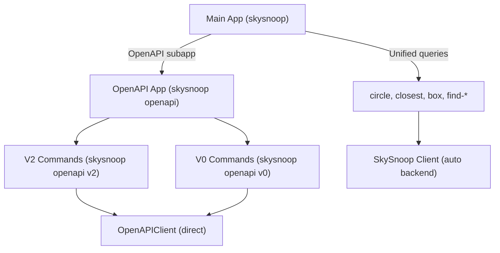

# CLI Development Guide

This document covers the internal architecture and development practices for the SkySnoop command-line interface. For usage documentation, see the main README.

## Overview

The CLI is built with [Typer](https://typer.tiangolo.com/) (which wraps [Click](https://click.palletsprojects.com/)) and provides a user-friendly interface to the SkySnoop SDK. The CLI automatically uses the high-level `SkySnoop` client with intelligent backend selection.

**Key Files**:

- `skysnoop/cli.py`: Main CLI commands and app definition
- `skysnoop/cli_formatters.py`: Output formatting utilities (table, JSON, compact)
- `tests/test_cli.py`: CLI command tests

## Architecture

### CLI Structure



### Command Hierarchy

1. **Main Commands** (`skysnoop [command]`): Use `SkySnoop` unified client
   - Geographic queries: `circle`, `closest`, `box`
   - Identifier queries: `find-hex`, `find-callsign`, `find-reg`, `find-type`
   - Bulk query: `all-aircraft`
   - Utility: `version`

2. **OpenAPI Commands** (`skysnoop openapi [subcommand]`): Direct OpenAPI access
   - `v2`: Aircraft queries via OpenAPI v2 endpoints
   - `v0`: Utility endpoints (me, routes)

## Key Components

### Command Decorators

#### @syncify

Converts async functions to synchronous for Typer compatibility.

```python
def syncify(f):
    """Convert async function to sync for Typer."""
    @wraps(f)
    def wrapper(*args, **kwargs):
        return asyncio.run(f(*args, **kwargs))
    return wrapper
```

**Usage**:

```python
@app.command()
@syncify
async def my_command():
    async with SkySnoop() as client:
        result = await client.get_by_hex("4CA87C")
```

#### @handle_errors

Catches and displays user-friendly error messages.

```python
def handle_errors(f):
    """Decorator to handle common errors in CLI commands."""
    @wraps(f)
    def wrapper(*args, **kwargs):
        try:
            return f(*args, **kwargs)
        except UnsupportedOperationError as e:
            typer.echo(f"Error: Unsupported operation - {e}", err=True)
            # ... helpful message
            raise typer.Exit(code=1)
        # ... handle other exceptions
```

**Caught Exceptions**:

- `UnsupportedOperationError`: Operation not available on current backend
- `TimeoutError`: Request timed out
- `APIError`: HTTP/API errors
- `ValidationError`: Invalid parameters
- `SkySnoopError`: Generic library errors

**Best Practices**:

- Always include helpful error messages
- Suggest solutions (e.g., "Try using --backend option")
- Use `typer.echo(..., err=True)` for errors
- Exit with code 1 for errors

### Backend Selection

#### get_client_for_backend()

Helper function that creates a `SkySnoop` client with the specified backend.

```python
def get_client_for_backend(backend: Optional[BackendChoice] = "auto"):
    """Get the appropriate client based on backend choice."""
    return SkySnoop(
        backend=backend,
        base_url=settings.adsb_api_base_url,
        timeout=settings.adsb_api_timeout,
    )
```

**Backend Options**:

- `"auto"` (default): Automatically select RE-API or OpenAPI based on environment
- `"reapi"`: Force RE-API backend (feeder-based queries)
- `"openapi"`: Force OpenAPI backend (public API)

**Usage in Commands**:

```python
@app.command()
async def my_command(
    backend: BackendChoice = typer.Option("auto", "--backend", help="Backend to use"),
):
    async with get_client_for_backend(backend) as client:
        result = await client.get_by_hex("4CA87C")
```

### Filter Building

#### _build_filters()

Helper function that constructs `QueryFilters` from CLI options.

```python
def _build_filters(
    callsign_exact: Optional[str] = None,
    callsign_prefix: Optional[str] = None,
    type_code: Optional[str] = None,
    squawk: Optional[str] = None,
    above_alt_baro: Optional[int] = None,
    below_alt_baro: Optional[int] = None,
    military: Optional[bool] = None,
    interesting: Optional[bool] = None,
) -> QueryFilters | None:
    """Build QueryFilters from command options."""
```

**Usage Pattern**:

```python
@app.command()
async def circle(
    # ... positional args ...
    type_code: Optional[str] = typer.Option(None, "--type", help="Filter by type"),
    above_alt_baro: Optional[int] = typer.Option(None, "--above-alt", help="Above altitude"),
    # ... other filter options ...
):
    filters = _build_filters(
        type_code=type_code,
        above_alt_baro=above_alt_baro,
        # ... pass all filter params
    )
    async with get_client_for_backend(backend) as client:
        result = await client.get_in_circle(lat, lon, radius, filters)
```

## Output Formatting

### format_output()

Main formatter for unified `SkyData` responses.

```python
def format_output(
    response: Union[APIResponse, SkyData],
    format_type: Literal["table", "json"] = "table",
) -> None:
```

**Formats**:

- `"table"`: Rich table with columns (hex, callsign, registration, type, altitude, speed, position, squawk)
- `"json"`: Machine-readable JSON output

**Usage**:

```python
json_output: bool = typer.Option(False, "--json", help="Output as JSON")

# In command body:
output_format = "json" if json_output else settings.cli_output_format
format_output(response, format_type=output_format)
```

### format_openapi_output()

Formatter for direct OpenAPI responses (`V2ResponseModel` or dict).

```python
def format_openapi_output(
    response: V2ResponseModel | dict[str, Any],
    format_type: Literal["table", "json"] = "table",
) -> None:
```

**Used by**: OpenAPI v2 and v0 commands

## Adding a New Command

### Step 1: Define Command Function

```python
@app.command(help="Brief description of command")
@handle_errors  # Add error handling
@syncify        # Convert async to sync
async def my_command(
    # Positional arguments
    param1: str = typer.Argument(..., help="Description"),
    param2: int = typer.Argument(..., help="Description"),

    # Optional filters (if applicable)
    type_code: Optional[str] = typer.Option(None, "--type", help="Filter by type"),
    above_alt_baro: Optional[int] = typer.Option(None, "--above-alt", help="Above altitude"),

    # Standard options
    json_output: bool = typer.Option(False, "--json", help="Output as JSON"),
    backend: BackendChoice = typer.Option("auto", "--backend", help="Backend to use"),
):
    """Detailed docstring for the command."""
```

### Step 2: Build Filters (if applicable)

```python
    filters = _build_filters(
        type_code=type_code,
        above_alt_baro=above_alt_baro,
        # ... other applicable filters
    )
```

### Step 3: Execute Query

```python
    async with get_client_for_backend(backend) as client:
        response = await client.my_method(param1, param2, filters)
```

### Step 4: Format Output

```python
    output_format = "json" if json_output else settings.cli_output_format
    format_output(response, format_type=output_format)
```

### Step 5: Add Tests

See [Testing CLI Commands](#testing-cli-commands) below.

## Testing CLI Commands

### Test Structure

CLI tests use Typer's `CliRunner` and mock the `SkySnoop` client.

```python
from typer.testing import CliRunner
from unittest.mock import AsyncMock, patch

runner = CliRunner()

@patch("skysnoop.cli.SkySnoop")
def test_my_command(mock_client_class, skydata_response):
    """Test my command with table output."""
    # Setup mock
    mock_client = AsyncMock()
    mock_client.my_method.return_value = skydata_response
    mock_client.__aenter__.return_value = mock_client
    mock_client.__aexit__.return_value = None
    mock_client_class.return_value = mock_client

    # Invoke command
    result = runner.invoke(app, ["my-command", "arg1", "arg2"])

    # Assertions
    assert result.exit_code == 0
    assert "expected output" in result.stdout
    mock_client.my_method.assert_called_once()
```

### Testing Patterns

#### Test Table Output

```python
@patch("skysnoop.cli.SkySnoop")
def test_command_table_output(mock_client_class, skydata_response):
    # ... setup mock ...
    result = runner.invoke(app, ["circle", "--", "37.7749", "-122.4194", "200"])

    assert result.exit_code == 0
    assert "Found" in result.stdout
    assert "aircraft" in result.stdout
```

#### Test JSON Output

```python
@patch("skysnoop.cli.SkySnoop")
def test_command_json_output(mock_client_class, skydata_response):
    # ... setup mock ...
    result = runner.invoke(app, ["circle", "--json", "--", "37.7749", "-122.4194", "200"])

    assert result.exit_code == 0
    output = json.loads(result.stdout)  # Verify valid JSON
    assert "aircraft" in output
    assert "result_count" in output
```

#### Test with Filters

```python
@patch("skysnoop.cli.SkySnoop")
def test_command_with_filters(mock_client_class, skydata_response):
    # ... setup mock ...
    result = runner.invoke(
        app,
        ["circle", "--type", "A321", "--above-alt", "20000", "--", "37.7749", "-122.4194", "200"],
    )

    assert result.exit_code == 0
    # Verify filters were passed to client
```

#### Test Empty Results

```python
@patch("skysnoop.cli.SkySnoop")
def test_command_empty_results(mock_client_class, empty_skydata_response):
    # ... setup mock ...
    result = runner.invoke(app, ["circle", "--", "37.7749", "-122.4194", "200"])

    assert result.exit_code == 0
    assert "No aircraft found" in result.stdout
```

#### Test Error Handling

```python
@patch("skysnoop.cli.SkySnoop")
def test_command_timeout_error(mock_client_class):
    mock_client = AsyncMock()
    mock_client.get_in_circle.side_effect = TimeoutError("Request timed out")
    mock_client.__aenter__.return_value = mock_client
    mock_client.__aexit__.return_value = None
    mock_client_class.return_value = mock_client

    result = runner.invoke(app, ["circle", "--", "37.7749", "-122.4194", "200"])

    assert result.exit_code == 1
    assert "timed out" in result.stdout
```

#### Test Backend Selection

```python
@patch("skysnoop.cli.SkySnoop")
def test_command_backend_option(mock_client_class, skydata_response):
    # ... setup mock ...
    result = runner.invoke(
        app,
        ["circle", "--backend", "openapi", "--", "37.7749", "-122.4194", "200"],
    )

    assert result.exit_code == 0
    # Verify SkySnoop was instantiated with correct backend
    mock_client_class.assert_called_once()
    call_kwargs = mock_client_class.call_args[1]
    assert call_kwargs["backend"] == "openapi"
```

### Test Fixtures

Use shared fixtures from `conftest.py`:

- `skydata_response`: SkyData with 2 aircraft
- `empty_skydata_response`: SkyData with 0 aircraft
- `single_skydata_response`: SkyData with 1 aircraft

## Command Design Guidelines

### DO

✅ **Use descriptive help text**: Both for the command and each parameter

```python
@app.command(help="Query aircraft within a circular area around a point.")
async def circle(
    lat: float = typer.Argument(..., help="Latitude of center point in decimal degrees"),
    # ...
):
```

✅ **Always include --json option**: For machine-readable output

```python
json_output: bool = typer.Option(False, "--json", help="Output as JSON")
```

✅ **Always include --backend option**: Allow users to override backend selection

```python
backend: BackendChoice = typer.Option("auto", "--backend", help="Backend to use (auto, reapi, openapi)")
```

✅ **Use consistent filter names**: Match the `QueryFilters` field names

```python
above_alt_baro: Optional[int] = typer.Option(None, "--above-alt", help="Filter above altitude (feet)")
```

✅ **Use -- separator for negative coordinates**: Prevents argument parsing issues

```bash
skysnoop circle -- 37.7749 -122.4194 200  # Correct
```

✅ **Provide helpful error messages**: Guide users to solutions

```python
typer.echo("Try using a different backend with --backend option (auto, reapi, or openapi).", err=True)
```

### DON'T

❌ **Don't use positional arguments for optional parameters**: Use `typer.Option` instead

❌ **Don't hardcode output formats**: Use `settings.cli_output_format` as default

❌ **Don't expose raw exceptions**: Always use `@handle_errors` decorator

❌ **Don't create client outside context manager**: Ensures proper cleanup

❌ **Don't duplicate filter logic**: Use `_build_filters()` helper

## Debugging Tips

### Enable Debug Logging

```python
import logging
logging.basicConfig(level=logging.DEBUG)
```

### Test Commands Manually

```bash
# Install in development mode
pip install -e .

# Run command with debug output
skysnoop circle --help
skysnoop circle -- 37.7749 -122.4194 50 --json
```

### Use Typer's Testing Tools

```python
from typer.testing import CliRunner

runner = CliRunner()
result = runner.invoke(app, ["circle", "--", "37.7749", "-122.4194", "200"])

print(result.stdout)
print(result.exit_code)
print(result.exception)  # If command raised exception
```

### Check Backend Selection

Add temporary logging to see which backend is selected:

```python
async with get_client_for_backend(backend) as client:
    typer.echo(f"Using backend: {client.backend}", err=True)  # Debug
    response = await client.get_in_circle(...)
```

## OpenAPI Subcommands

The CLI includes direct OpenAPI access for advanced users who need features not available through the unified client.

### Structure

```text
skysnoop openapi          # OpenAPI subcommand group
├── v2                    # Aircraft queries
│   ├── hex
│   ├── callsign
│   ├── registration
│   ├── type
│   ├── point
│   ├── closest
│   └── ladd
└── v0                    # Utility endpoints
    ├── me
    └── routes
```

### Adding OpenAPI Commands

```python
@v2_app.command(help="Query aircraft by ICAO hex code")
@handle_errors
@syncify
async def hex(
    icao_hex: str = typer.Argument(..., help="ICAO 24-bit hex code"),
    json_output: bool = typer.Option(False, "--json", help="Output as JSON"),
):
    """Query aircraft by hex code via OpenAPI."""
    async with OpenAPIClient() as client:
        response = await client.v2.get_by_hex(icao_hex=icao_hex)

    output_format = "json" if json_output else settings.cli_output_format
    format_openapi_output(response, format_type=output_format)
```

## Settings Integration

CLI commands respect settings from `skysnoop.settings`:

```python
from .settings import settings

# Use in commands
base_url = settings.adsb_api_base_url  # Default API URL
timeout = settings.adsb_api_timeout    # Default timeout
output_format = settings.cli_output_format  # Default output format
```

**Configurable via Environment Variables**:

```bash
export ADSB_API_BASE_URL="https://custom.api.url"
export ADSB_API_TIMEOUT="60.0"
export CLI_OUTPUT_FORMAT="json"
```

## Common Issues

### Issue: Negative Coordinates Not Parsed

**Problem**: `-122.4194` interpreted as flag

**Solution**: Use `--` separator

```bash
skysnoop circle -- 37.7749 -122.4194 200
```

### Issue: Async Function Not Working

**Problem**: Typer doesn't support async directly

**Solution**: Use `@syncify` decorator

```python
@app.command()
@syncify  # Converts async to sync
async def my_command():
    # async code here
```

### Issue: Context Manager Not Cleaning Up

**Problem**: Client not closed properly

**Solution**: Always use `async with`

```python
async with get_client_for_backend(backend) as client:
    # Use client here
# Automatically cleaned up
```

## Resources

- **Typer Documentation**: <https://typer.tiangolo.com/>
- **Rich Library** (tables/formatting): <https://rich.readthedocs.io/>
- **Testing Guide**: See [testing.md](./testing.md)
- **Architecture**: See [architecture.md](./architecture.md)
