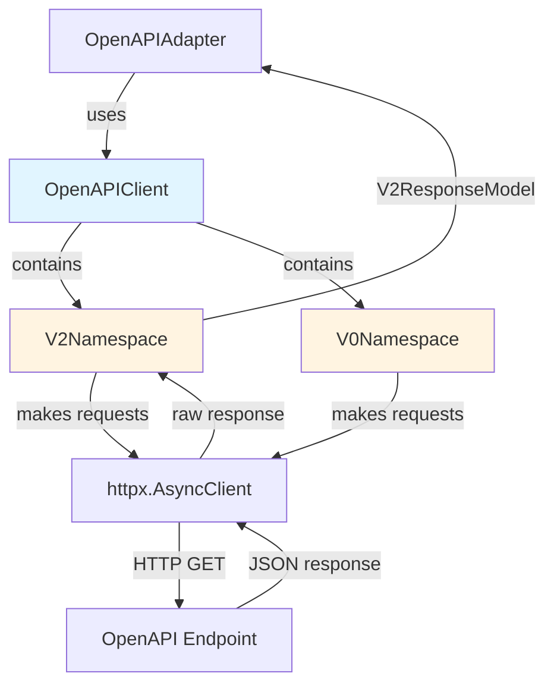

# OpenAPI Client (Developer Documentation)

> **For Users**: See [Advanced Usage](../advanced.md#low-level-clients) for usage examples of the low-level clients.

This document covers the internal implementation details of the `OpenAPIClient` low-level client for developers working on the library.

## Overview

The OpenAPI client (`OpenAPIClient`) is the low-level client that directly communicates with the public adsb.lol API at `https://api.adsb.lol`. It provides:

- **Auto-generated Models**: Pydantic models generated from official OpenAPI spec
- **Namespace Organization**: Separate v2 (aircraft) and v0 (utility) namespaces
- **Direct API Access**: Makes HTTP requests to OpenAPI endpoints
- **Native Responses**: Returns `V2ResponseModel` objects (not normalized `SkyData`)
- **Type Safety**: Full typing through generated models

**Location**: `skysnoop/client/openapi.py`

## Architecture



## Implementation Details

### Constructor

```python
def __init__(
    self,
    api_key: str | None = None,
    base_url: str | None = None,
    timeout: float = 30.0,
):
    """Initialize OpenAPI client."""
    self.api_key = api_key
    self.base_url = base_url or "https://api.adsb.lol"
    self.timeout = timeout
    self._client: httpx.AsyncClient | None = None

    # Lazy initialization of namespaces
    self._v2: V2Namespace | None = None
    self._v0: V0Namespace | None = None
```

**Key Points**:

- Lazy initialization: HTTP client and namespaces created in `__aenter__`
- API key stored but not yet used (future requirement)
- Base URL defaults to production OpenAPI

### Context Manager Implementation

```python
async def __aenter__(self) -> "OpenAPIClient":
    """Initialize HTTP client and namespaces."""
    headers = {}
    if self.api_key:
        headers["Authorization"] = f"Bearer {self.api_key}"

    self._client = httpx.AsyncClient(
        base_url=self.base_url,
        timeout=self.timeout,
        headers=headers,
    )

    self._v2 = V2Namespace(self._client)
    self._v0 = V0Namespace(self._client)

    return self

async def __aexit__(self, exc_type, exc_val, exc_tb):
    """Cleanup HTTP client."""
    if self._client:
        await self._client.aclose()
        self._client = None
        self._v2 = None
        self._v0 = None
```

**Pattern**: Namespaces are created with shared HTTP client. This allows all requests to share connection pooling and configuration.

### Namespace Properties

```python
@property
def v2(self) -> "V2Namespace":
    """Access v2 (aircraft) namespace."""
    if self._v2 is None:
        raise RuntimeError("OpenAPIClient must be used as context manager")
    return self._v2

@property
def v0(self) -> "V0Namespace":
    """Access v0 (utility) namespace."""
    if self._v0 is None:
        raise RuntimeError("OpenAPIClient must be used as context manager")
    return self._v0
```

**Why Properties**: Clear error if user forgets context manager. Type checker sees concrete namespace types, not Optional.

## Namespace Implementation

### V2Namespace (Aircraft Queries)

**Location**: `skysnoop/client/openapi.py`

All v2 methods follow the same pattern:

```python
class V2Namespace:
    """V2 (aircraft) endpoint namespace."""

    def __init__(self, client: httpx.AsyncClient):
        self._client = client

    async def get_by_hex(self, icao_hex: str) -> V2ResponseModel:
        """Get aircraft by ICAO hex code."""
        response = await self._client.get(f"/v2/hex/{icao_hex}")
        response.raise_for_status()
        data = response.json()
        return V2ResponseModel(**data)
```

**Key Steps**:

1. **HTTP Request**: Use httpx client to GET from endpoint
2. **Status Check**: Raise error for 4xx/5xx responses
3. **JSON Parsing**: Parse response to dict
4. **Model Validation**: Create Pydantic model from dict

**Available Methods**:

- `get_by_hex(icao_hex)`: Get by ICAO hex code
- `get_by_callsign(callsign)`: Get by callsign
- `get_by_registration(registration)`: Get by registration
- `get_by_type(aircraft_type)`: Get by aircraft type
- `get_by_squawk(squawk)`: Get by squawk code
- `get_mil()`: Get military aircraft
- `get_pia()`: Get privacy-flagged aircraft
- `get_ladd()`: Get LADD-protected aircraft
- `get_by_point(lat, lon, radius)`: Get aircraft near point
- `get_closest(lat, lon, radius)`: Get closest aircraft

### V0Namespace (Utility Queries)

**Location**: `skysnoop/client/openapi.py`

V0 endpoints return raw dicts (no models):

```python
class V0Namespace:
    """V0 (utility) endpoint namespace."""

    def __init__(self, client: httpx.AsyncClient):
        self._client = client

    async def get_me(self) -> dict:
        """Get feeder information."""
        response = await self._client.get("/v0/me")
        response.raise_for_status()
        return response.json()

    async def get_routes(self, planes: list[str]) -> dict:
        """Get routes for aircraft."""
        params = {"planes": ",".join(planes)}
        response = await self._client.get("/v0/routes", params=params)
        response.raise_for_status()
        return response.json()
```

**Why No Models**: V0 endpoints have variable structure. Raw dicts provide flexibility.

## Model Generation

### Auto-Generated Models

**Location**: `skysnoop/models/openapi/generated.py`

Models are auto-generated from the official OpenAPI spec using `datamodel-code-generator`:

```bash
# Generate models from spec
datamodel-codegen \
    --input resources/openapi_spec.json \
    --output skysnoop/models/openapi/generated.py \
    --input-file-type openapi \
    --output-model-type pydantic_v2.BaseModel
```

**Generated Classes**:

- `V2ResponseModel`: Top-level v2 response
- `V2ResponseAcItem`: Individual aircraft in response
- Many other models for various fields

### Model Characteristics

```python
class V2ResponseModel(BaseModel):
    """Auto-generated from OpenAPI spec."""
    ac: List[V2ResponseAcItem]
    ctime: float
    msg: str
    now: float
    ptime: int
    total: int

class V2ResponseAcItem(BaseModel):
    """Individual aircraft - 100+ optional fields."""
    hex: str  # Required
    flight: str | None = None
    alt_baro: int | None = None
    gs: float | None = None
    lat: float | None = None
    lon: float | None = None
    r: str | None = None  # registration
    t: str | None = None  # type
    squawk: str | None = None
    emergency: str | None = None
    category: str | None = None
    # ... 100+ more fields
```

**Key Points**:

- Most fields optional (aircraft may not report all data)
- Field names match OpenAPI spec exactly (short names like `r`, `t`)
- Pydantic validation ensures type safety
- Auto-generated code should not be manually edited

### Keeping Models Updated

When OpenAPI spec changes:

1. Download new spec to `resources/openapi_spec.json`
2. Run code generator (see above command)
3. Review generated code for breaking changes
4. Update `OpenAPIAdapter` normalization if field mappings change
5. Update tests if response structure changes

## Usage by OpenAPIAdapter

**Location**: `skysnoop/client/adapters/openapi.py`

The `OpenAPIAdapter` wraps `OpenAPIClient` and implements `BackendProtocol`:

```python
class OpenAPIAdapter:
    """Adapter for OpenAPI backend."""

    def __init__(
        self,
        api_key: str | None = None,
        base_url: str | None = None,
        timeout: float = 30.0,
    ):
        self._client = OpenAPIClient(
            api_key=api_key,
            base_url=base_url,
            timeout=timeout,
        )

    async def get_by_hex(self, hex_code: str) -> SkyData:
        """Get aircraft by hex - implements BackendProtocol."""
        response = await self._client.v2.get_by_hex(icao_hex=hex_code)
        return self._normalize_response(response)

    def _normalize_response(self, response: V2ResponseModel) -> SkyData:
        """Convert V2ResponseModel to SkyData."""
        # Map OpenAPI fields to Aircraft fields
        aircraft_list = []
        for item in response.ac:
            aircraft = Aircraft(
                hex=item.hex,
                flight=item.flight,
                alt_baro=item.alt_baro,
                gs=item.gs,
                lat=item.lat,
                lon=item.lon,
                r=item.r,  # registration
                t=item.t,  # type
                squawk=item.squawk,
                # ... map all relevant fields
            )
            aircraft_list.append(aircraft)

        return SkyData(
            result_count=response.total,
            timestamp=response.now,
            backend="openapi",
            simulated=False,
            aircraft=aircraft_list,
        )
```

**Key Pattern**:

1. Adapter creates `OpenAPIClient` instance
2. Adapter delegates query to `client.v2.method()`
3. Client returns `V2ResponseModel`
4. Adapter normalizes to `SkyData` for `BackendProtocol`

**Field Mapping**: `V2ResponseAcItem` uses short field names (`r`, `t`) that must be mapped to `Aircraft` model fields.

## Testing Strategy

### Unit Tests

**Location**: `tests/client/test_openapi.py`

**Approach**: Mock HTTP client to test namespace methods and model parsing:

```python
@pytest.mark.asyncio
async def test_v2_get_by_hex():
    """Test v2.get_by_hex method."""
    mock_client = Mock()
    mock_client.get = AsyncMock(return_value=Mock(
        json=lambda: {
            "ac": [{"hex": "4CA87C", "flight": "TEST123"}],
            "ctime": 123.0,
            "msg": "No error",
            "now": 123.0,
            "ptime": 10,
            "total": 1,
        },
        raise_for_status=lambda: None
    ))

    client = OpenAPIClient()
    client._v2 = V2Namespace(mock_client)

    response = await client.v2.get_by_hex("4CA87C")

    assert isinstance(response, V2ResponseModel)
    assert response.total == 1
    assert response.ac[0].hex == "4CA87C"

@pytest.mark.asyncio
async def test_model_validation():
    """Test that invalid data raises validation error."""
    mock_client = Mock()
    mock_client.get = AsyncMock(return_value=Mock(
        json=lambda: {"invalid": "data"},
        raise_for_status=lambda: None
    ))

    client = OpenAPIClient()
    client._v2 = V2Namespace(mock_client)

    with pytest.raises(ValidationError):
        await client.v2.get_by_hex("4CA87C")
```

### Integration Tests

**Location**: `tests/integration/test_live_openapi.py`

**Approach**: Test against real OpenAPI:

```python
@pytest.mark.asyncio
async def test_openapi_get_by_hex():
    """Test v2.get_by_hex against live API."""
    async with OpenAPIClient() as client:
        response = await client.v2.get_by_hex("4CA87C")

        assert isinstance(response, V2ResponseModel)
        assert response.total >= 0
        assert isinstance(response.ac, list)
```

## Related Documentation

- **[Backend Protocol](./backend-protocol.md)**: How adapters integrate with SkySnoop
- **[RE-API Client](./reapi-client.md)**: Alternative low-level client for RE-API
- **[Architecture](./architecture.md)**: Overall system architecture
- **[Testing](./testing.md)**: Testing strategies

## User Documentation

For usage examples and common patterns, see:

- **[Advanced Usage](../advanced.md#low-level-clients)**: Using low-level clients directly
- **[Getting Started](../getting-started.md)**: Basic usage patterns

### Validation Errors

If you receive unexpected validation errors, the API spec may have changed:

```bash
# Update to latest models
make openapi-update

# Check current spec version
python -c "from adsblol.client.openapi_version import OPENAPI_VERSION; print(OPENAPI_VERSION)"
```

### Rate Limiting

If you encounter rate limiting (429 errors):

- Wait for the duration specified in `retry_after`
- Consider caching responses
- Request an API key (when available)

### Connection Errors

For connection timeouts or network errors:

- Check your internet connection
- Verify the API is accessible: `curl https://api.adsb.lol/api/v2/hex/4CA87C`
- Increase timeout if needed

## Resources

- **OpenAPI Spec**: <https://api.adsb.lol/api/openapi.json>
- **API Documentation**: <https://api.adsb.lol/docs>
- **Model Generation**: [datamodel-code-generator](https://github.com/koxudaxi/datamodel-code-generator)
- **HTTP Client**: [httpx](https://www.python-httpx.org/)
- **Validation**: [Pydantic](https://docs.pydantic.dev/)

## See Also

- [API Client (RE-API)](./api-client.md) - Legacy feeder-based client
- [Architecture](./architecture.md) - Overall project architecture
- [CLI Commands](./cli.md) - Command-line interface documentation
- [Testing](./testing.md) - Testing guidelines
