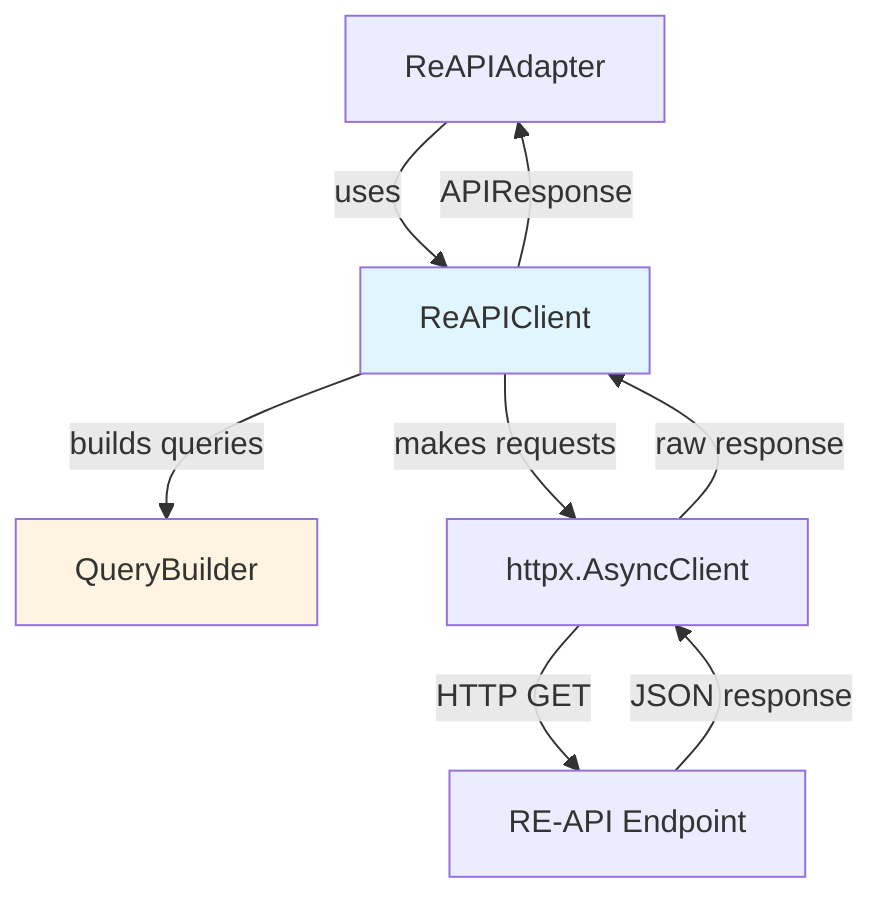

# RE-API Client (Developer Documentation)

> **For Users**: See [Advanced Usage](../advanced.md#low-level-clients) for usage examples of the low-level clients.

This document covers the internal implementation details of the `ReAPIClient` low-level client for developers working on the library.

## Overview

The RE-API client (`ReAPIClient`) is the low-level client that directly communicates with the feeder-based adsb.lol API at `https://re-api.adsb.lol/`. It provides:

- **Direct API Access**: Makes HTTP requests to RE-API endpoints
- **Query Building**: Uses `QueryBuilder` to construct query strings
- **Native Responses**: Returns `APIResponse` objects (Pydantic models matching API structure)
- **Filter Support**: Integrates with `QueryFilters` for advanced filtering
- **HTTP Client Management**: Uses httpx.AsyncClient for async requests

**Location**: `skysnoop/client/api.py`

## Architecture



## Implementation Details

### Constructor

```python
def __init__(
    self,
    base_url: str | None = None,
    timeout: float = 30.0,
):
    """Initialize RE-API client."""
    self.base_url = base_url or "https://re-api.adsb.lol/"
    self.timeout = timeout
    self._client: httpx.AsyncClient | None = None
```

**Key Points**:

- Lazy initialization: HTTP client created in `__aenter__`, not `__init__`
- Base URL defaults to production RE-API
- Timeout configurable for large queries

### Context Manager Implementation

```python
async def __aenter__(self) -> "ReAPIClient":
    """Initialize HTTP client."""
    self._client = httpx.AsyncClient(
        base_url=self.base_url,
        timeout=self.timeout,
    )
    return self

async def __aexit__(self, exc_type, exc_val, exc_tb):
    """Cleanup HTTP client."""
    if self._client:
        await self._client.aclose()
        self._client = None
```

**Pattern**: HTTP client lifecycle managed by context manager. This ensures proper connection cleanup and resource management.
        ## Query Method Implementation

Each query method follows the same pattern:

```python
async def circle(
    self,
    lat: float,
    lon: float,
    radius: float,
    filters: QueryFilters | None = None,
) -> APIResponse:
    """Search for aircraft within a circular area."""
    # 1. Build query string
    query = QueryBuilder.build_circle(
        lat=lat, lon=lon, radius=radius, filters=filters
    )

    # 2. Make request
    response = await self._request(query)

    # 3. Parse and return
    return APIResponse(**response)

async def _request(self, query: str) -> dict:
    """Make HTTP request to API."""
    if not self._client:
        raise RuntimeError("Client not initialized")

    response = await self._client.get(f"?{query}")
    response.raise_for_status()
    return response.json()
```

**Key Steps**:

1. **Query Building**: Use `QueryBuilder` to construct URL query string
2. **HTTP Request**: Use httpx client to GET from API
3. **Response Parsing**: Parse JSON into `APIResponse` Pydantic model

### QueryBuilder Integration

**Location**: `skysnoop/query/builder.py`

The `QueryBuilder` handles:

- **Query String Construction**: Builds `key=value` pairs
- **Filter Application**: Adds filter parameters to query string
- **Comma Preservation**: Preserves commas in coordinates and lists
- **Parameter Validation**: Validates required parameters

Example:

```python
QueryBuilder.build_circle(
    lat=37.7749,
    lon=-122.4194,
    radius=200,
    filters=QueryFilters(type_code="B738")
)
# Returns: "circle=37.7749,-122.4194,200&filter_type=B738"
```

**Important**: QueryBuilder preserves commas in coordinate values. This is critical because commas are part of the API's query format (e.g., `circle=lat,lon,radius`).

### APIResponse Model

**Location**: `skysnoop/models/response.py`

```python
class APIResponse(BaseModel):
    """RE-API response model."""
    now: float
    resultCount: int  # camelCase to match API
    aircraft: List[Aircraft]
    ptime: float = 0.0

    class Config:
        """Allow camelCase field names to match API."""
        populate_by_name = True
```

**Key Points**:

- Uses camelCase for `resultCount` to match RE-API JSON structure
- Pydantic handles JSON parsing and validation
- Aircraft list automatically parsed into `Aircraft` objects
- Optional fields (like `ptime`) have defaults

## Method Categories

### Geographic Queries

- `circle(lat, lon, radius, filters)`: Search within circular area
- `box(lat_min, lat_max, lon_min, lon_max, filters)`: Search within bounding box
- `closest(lat, lon, radius, filters)`: Find closest aircraft

### Identifier Queries

- `find_hex(hex_code)`: Lookup by ICAO hex
- `find_callsign(callsign, filters)`: Find by callsign
- `find_reg(registration, filters)`: Find by registration
- `find_type(type_code, filters)`: Find by aircraft type

### Bulk Queries

- `all_with_pos(filters)`: Get all aircraft with position data

## Testing Strategy

### Unit Tests

**Location**: `tests/client/test_api.py`

**Approach**: Mock HTTP client to test query building and response parsing:

```python
@pytest.mark.asyncio
async def test_circle_query_building():
    """Test that circle builds correct query string."""
    mock_client = Mock()
    mock_client.get = AsyncMock(return_value=Mock(
        json=lambda: {"now": 123, "resultCount": 1, "aircraft": []},
        raise_for_status=lambda: None
    ))

    client = ReAPIClient()
    client._client = mock_client

    await client.circle(37.7749, -122.4194, 200)

    # Verify query string
    mock_client.get.assert_called_once()
    call_args = mock_client.get.call_args[0][0]
    assert "circle=37.7749,-122.4194,200" in call_args

@pytest.mark.asyncio
async def test_filter_integration():
    """Test that filters are properly integrated."""
    client = ReAPIClient()
    # ... similar mock setup ...

    filters = QueryFilters(type_code="B738")
    await client.circle(37.7749, -122.4194, 200, filters=filters)

    call_args = mock_client.get.call_args[0][0]
    assert "filter_type=B738" in call_args
```

### Integration Tests

**Location**: `tests/integration/test_live_api.py`

**Approach**: Test against real RE-API:

```python
@pytest.mark.asyncio
async def test_reapi_circle():
    """Test circle query against live API."""
    async with ReAPIClient() as client:
        response = await client.circle(37.7749, -122.4194, 50)

        assert isinstance(response, APIResponse)
        assert response.resultCount >= 0
        assert isinstance(response.aircraft, list)
```

**Returns**: `APIResponse` with aircraft in the box

```

## Usage by ReAPIAdapter

**Location**: `skysnoop/client/adapters/reapi.py`

The `ReAPIAdapter` wraps `ReAPIClient` and implements `BackendProtocol`:

```python
class ReAPIAdapter:
    """Adapter for RE-API backend."""

    def __init__(self, base_url: str | None = None, timeout: float = 30.0):
        self._client = ReAPIClient(base_url=base_url, timeout=timeout)

    async def get_by_hex(self, hex_code: str) -> SkyData:
        """Get aircraft by hex - implements BackendProtocol."""
        response = await self._client.find_hex(hex_code)
        return self._normalize_response(response)

    def _normalize_response(self, response: APIResponse) -> SkyData:
        """Convert APIResponse to SkyData."""
        return SkyData(
            result_count=response.resultCount,
            timestamp=response.now,
            backend="reapi",
            simulated=False,
            aircraft=response.aircraft,
        )
```

**Key Pattern**:

1. Adapter creates `ReAPIClient` instance
2. Adapter delegates query to client
3. Client returns `APIResponse`
4. Adapter normalizes to `SkyData` for `BackendProtocol`

## Related Documentation

- **[Backend Protocol](./backend-protocol.md)**: How adapters integrate with SkySnoop
- **[QueryBuilder](./architecture.md#query-builder)**: Query string construction
- **[QueryFilters](./architecture.md#query-filters)**: Filter implementation
- **[OpenAPI Client](./openapi-client.md)**: Alternative low-level client
- **[Testing](./testing.md)**: Testing strategies

## User Documentation

For usage examples and common patterns, see:

- **[Advanced Usage](../advanced.md#low-level-clients)**: Using low-level clients directly
- **[Query Filters](../filters.md)**: Complete filter guide
        print(f"API error: {e}")
    except ValidationError as e:
        print(f"Invalid parameters: {e}")

```

## Configuration

### Custom Base URL

```python
async with ReAPIClient(base_url="https://custom.feeder.url/") as client:
    response = await client.circle(37.7749, -122.4194, 50)
```

### Custom Timeout

```python
async with ReAPIClient(timeout=60.0) as client:
    response = await client.all_with_pos()  # May take longer
```

### Environment Variables

Configure via environment variables (see [settings.md](./settings.md)):

```bash
export ADSB_API_BASE_URL="https://custom.feeder.url/"
export ADSB_API_TIMEOUT="60.0"
```

## Advanced Usage

### Using with HTTP Client Directly

```python
from skysnoop.client.base import BaseHTTPClient
from skysnoop.query.builder import QueryBuilder

async with BaseHTTPClient(base_url="https://re-api.adsb.lol/") as http_client:
    query = QueryBuilder.build_circle(lat=37.7749, lon=-122.4194, radius=200)
    data = await http_client.get(query)
    # data is raw dict, not APIResponse
```

### Comma Preservation

The RE-API requires commas in query parameters (e.g., `circle=37.7749,-122.4194,200`). The client preserves commas by building query strings manually rather than using URL encoding:

```python
# ✅ Correct (commas preserved)
"circle=37.7749,-122.4194,200"

# ❌ Wrong (commas encoded)
"circle=37.7749%2C-122.4194%2C200"
```

This is handled automatically by `QueryBuilder` and `BaseHTTPClient`.

## Comparison: SkySnoop vs ReAPIClient

| Feature | SkySnoop (High-Level) | ReAPIClient (Low-Level) |
|---------|----------------------|------------------------|
| **Interface** | Unified `get_*` methods | RE-API-specific methods |
| **Response Model** | `SkyData` (normalized) | `APIResponse` (RE-API) |
| **Backend Selection** | Automatic or manual | RE-API only |
| **Query Filters** | Full support | Full support |
| **Error Handling** | `UnsupportedOperationError` | Direct API errors |
| **Use Case** | ✅ **Recommended for most apps** | Advanced RE-API work |

## Testing

### Mocking ReAPIClient

```python
from unittest.mock import AsyncMock, patch
from skysnoop.client import ReAPIClient
from skysnoop.models.response import APIResponse

@patch("my_module.ReAPIClient")
async def test_my_function(mock_client_class):
    # Setup mock
    mock_client = AsyncMock()
    mock_response = APIResponse(
        now=1234567890.0,
        resultCount=1,
        ptime=0.01,
        aircraft=[...]
    )
    mock_client.circle.return_value = mock_response
    mock_client.__aenter__.return_value = mock_client
    mock_client.__aexit__.return_value = None
    mock_client_class.return_value = mock_client

    # Test your code
    result = await my_function()

    assert result is not None
    mock_client.circle.assert_called_once()
```

### Integration Tests

```python
import pytest
from skysnoop.client import ReAPIClient

@pytest.mark.asyncio
@pytest.mark.live_api  # Requires feeder access
async def test_reapi_circle_live():
    async with ReAPIClient() as client:
        response = await client.circle(
            lat=37.7749,
            lon=-122.4194,
            radius=50
        )

        assert response.resultCount >= 0
        assert response.now > 0
```

## Best Practices

### DO

✅ **Use async context manager**: Ensures proper cleanup

```python
async with ReAPIClient() as client:
    response = await client.circle(37.7749, -122.4194, 200)
```

✅ **Use QueryFilters for complex queries**: Clean and type-safe

```python
filters = QueryFilters(type_code="B738", above_alt_baro=20000)
response = await client.circle(37.7749, -122.4194, 200, filters=filters)
```

✅ **Handle exceptions appropriately**: Network and API errors can occur

✅ **Consider SkySnoop first**: Use ReAPIClient only when you need direct access

### DON'T

❌ **Don't forget to close**: Always use context manager or close manually

❌ **Don't URL-encode query strings manually**: Use QueryBuilder

❌ **Don't bypass validation**: Use QueryFilters for type safety

❌ **Don't use for new code**: Prefer SkySnoop unless you have specific needs

## See Also

- **[SkySnoop Client](./skysnoop-client.md)**: High-level unified client (recommended)
- **[OpenAPI Client](./openapi-client.md)**: Low-level OpenAPI client
- **[Architecture](./architecture.md)**: System architecture and design patterns
- **[Query Building](./architecture.md#query-building)**: Query construction details
- **[Testing](./testing.md)**: Testing strategies and patterns
