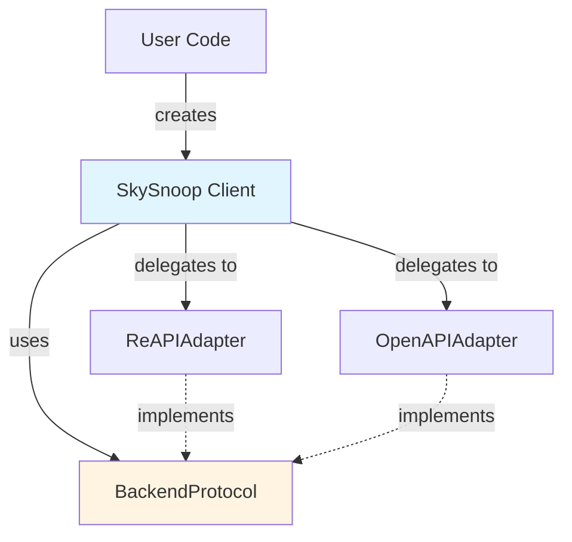

# SkySnoop Client (Developer Documentation)

> **For Users**: See [User Documentation](../skysnoop-client.md) for usage examples and API reference.

This document covers the internal implementation details of the `SkySnoop` unified client for developers working on the library.

## Overview

The SkySnoop client (`SkySnoop`) is the high-level unified interface that sits on top of the backend adapter layer. It provides:

- **Backend Abstraction**: Uses `BackendProtocol` to work with any adapter
- **Lifecycle Management**: Handles adapter initialization and cleanup
- **Method Delegation**: Passes calls through to the selected adapter
- **Type Safety**: Enforces `BackendProtocol` contract at runtime

**Location**: `skysnoop/client/skysnoop.py`

## Architecture



## Implementation Details

### Constructor

```python
def __init__(
    self,
    backend: Literal["auto", "openapi", "reapi"] = "auto",
    api_key: str | None = None,
    base_url: str | None = None,
    timeout: float = 30.0,
):
```

**Backend Selection Logic**:

1. If `backend == "auto"`:
   - Call `select_backend_sync(api_key, prefer_reapi=True)`
   - Store result in `self.backend_type`
2. If explicit backend specified, store it
3. Store configuration for later adapter instantiation

**Key Design Decision**: Backend selection happens in constructor (synchronous), but adapter instantiation happens in `__aenter__` (async). This allows backend type to be determined without requiring async context.

### Context Manager Implementation

```python
async def __aenter__(self) -> "SkySnoop":
    """Instantiate and initialize the selected adapter."""
    if self.backend_type == "openapi":
        self._adapter = OpenAPIAdapter(
            api_key=self._api_key,
            base_url=self._base_url,
            timeout=self._timeout,
        )
    else:  # reapi
        self._adapter = ReAPIAdapter(
            base_url=self._base_url,
            timeout=self._timeout,
        )

    await self._adapter.__aenter__()
    return self

async def __aexit__(self, exc_type, exc_val, exc_tb):
    """Cleanup adapter resources."""
    if self._adapter:
        await self._adapter.__aexit__(exc_type, exc_val, exc_tb)
        self._adapter = None
```

**Pattern**: Adapter is instantiated in `__aenter__` and immediately entered. This ensures the adapter's HTTP client is properly initialized before any queries.

### Method Delegation

All query methods follow the same pattern - delegate to the adapter:

```python
async def get_by_hex(self, hex_code: str) -> SkyData:
    """Get aircraft by ICAO hex code."""
    adapter = self._ensure_adapter()
    return await adapter.get_by_hex(hex_code)

def _ensure_adapter(self) -> BackendProtocol:
    """Ensure adapter is initialized, raise error if not."""
    if self._adapter is None:
        raise RuntimeError("SkySnoop must be used as an async context manager")
    return self._adapter
```

**Why This Pattern**:

- Simple delegation - no logic in SkySnoop methods
- Type checker sees `BackendProtocol` return from `_ensure_adapter()`
- Clear error if user forgets context manager
- No need for SkySnoop to know about adapter internals

## Backend Selection Module

**Location**: `skysnoop/client/backend_selection.py`

### select_backend_sync()

```python
def select_backend_sync(
    api_key: str | None = None,
    prefer_reapi: bool = True,
) -> BackendType:
    """Synchronous backend selection for use in __init__."""
    if api_key:
        return "openapi"

    if prefer_reapi:
        return "reapi"

    return "openapi"
```

**Design Rationale**:

- Synchronous so it can be called from `__init__`
- Simple logic - no network calls or async operations
- Prefer RE-API by default (stable, full features)
- API key presence triggers OpenAPI selection

### Future Enhancement

The async version `select_backend()` exists for future use:

```python
async def select_backend(...) -> BackendType:
    """Async backend selection (future: ping backends, check availability)."""
```

This could be used to:

- Ping backends to check availability
- Query backend capabilities
- Load backend preferences from remote config

## Method Reference

> **For Usage Examples**: See [User Documentation](../skysnoop-client.md) for detailed usage of each method.

The SkySnoop client implements all methods defined in `BackendProtocol`. Each method:

1. Calls `_ensure_adapter()` to get the adapter
2. Delegates to the adapter's implementation
3. Returns `SkyData` (normalized response)

### Method Categories

**Identifier Queries** (1:1 lookups):

- `get_by_hex(hex_code: str) -> SkyData`
- `get_by_callsign(callsign: str, filters: QueryFilters | None) -> SkyData`
- `get_by_registration(registration: str, filters: QueryFilters | None) -> SkyData`
- `get_by_type(type_code: str, filters: QueryFilters | None) -> SkyData`

**Geographic Queries** (spatial search):

- `get_in_circle(lat: float, lon: float, radius: float, filters: QueryFilters | None) -> SkyData`
- `get_in_box(lat_min: float, lat_max: float, lon_min: float, lon_max: float, filters: QueryFilters | None) -> SkyData`
- `get_closest(lat: float, lon: float, radius: float, filters: QueryFilters | None) -> SkyData`

**Bulk Queries** (full dataset):

- `get_all(filters: QueryFilters | None) -> SkyData`
- `get_all_with_pos(filters: QueryFilters | None) -> SkyData` (alias for get_all)

### Implementation Pattern

All methods follow this pattern:

```python
async def method_name(self, param: Type, ...) -> SkyData:
    """Docstring with user-facing description."""
    adapter = self._ensure_adapter()
    return await adapter.method_name(param, ...)
```

**Why This Pattern**:

- No business logic in SkySnoop - pure delegation
- Type safety enforced by protocol
- Easy to add new methods (just add to protocol and adapters)
- Testing is straightforward (mock the adapter)

## Testing Strategy

### Unit Tests

**Location**: `tests/client/test_skysnoop.py`

**Approach**: Mock the adapter to test SkySnoop behavior:

```python
@pytest.mark.asyncio
async def test_backend_selection_auto():
    """Test automatic backend selection logic."""
    client = SkySnoop(backend="auto")
    assert client.backend_type == "reapi"

    client_with_key = SkySnoop(backend="auto", api_key="test")
    assert client_with_key.backend_type == "openapi"

@pytest.mark.asyncio
async def test_context_manager():
    """Test adapter lifecycle management."""
    client = SkySnoop()

    # Before entering: no adapter
    assert client._adapter is None

    async with client as c:
        # Inside context: adapter exists
        assert c._adapter is not None
        assert isinstance(c._adapter, ReAPIAdapter)

    # After exiting: adapter cleaned up
    assert client._adapter is None

@pytest.mark.asyncio
async def test_method_delegation():
    """Test that methods delegate to adapter correctly."""
    mock_adapter = Mock(spec=BackendProtocol)
    mock_adapter.get_by_hex.return_value = create_test_skydata()

    client = SkySnoop()
    client._adapter = mock_adapter

    result = await client.get_by_hex("4CA87C")

    mock_adapter.get_by_hex.assert_called_once_with("4CA87C")
    assert result.result_count > 0
```

### Integration Tests

**Location**: `tests/integration/test_live_skysnoop.py`

**Approach**: Test with real adapters against live API:

```python
@pytest.mark.asyncio
async def test_skysnoop_with_reapi():
    """Test SkySnoop with RE-API backend."""
    async with SkySnoop(backend="reapi") as client:
        result = await client.get_by_hex("4CA87C")

        assert result.backend == "reapi"
        assert result.result_count >= 0
        assert not result.simulated

@pytest.mark.asyncio
async def test_backend_auto_selection():
    """Test automatic backend selection."""
    async with SkySnoop() as client:
        # Should select RE-API by default
        result = await client.get_in_circle(37.7749, -122.4194, 50)
        assert result.backend == "reapi"
```

## Error Handling Implementation

### UnsupportedOperationError

Raised by adapters when operation not available on that backend. SkySnoop passes these through:

```python
async def get_by_hex(self, hex_code: str) -> SkyData:
    """Get aircraft by hex code."""
    adapter = self._ensure_adapter()
    try:
        return await adapter.get_by_hex(hex_code)
    except UnsupportedOperationError:
        # Let it bubble up to caller
        raise
```

**Pattern**: SkySnoop doesn't catch `UnsupportedOperationError` - it lets the adapter raise it. This gives users clear feedback about backend limitations.

### RuntimeError for Missing Context Manager

```python
def _ensure_adapter(self) -> BackendProtocol:
    """Ensure adapter exists, raise RuntimeError if not."""
    if self._adapter is None:
        raise RuntimeError(
            "SkySnoop must be used as an async context manager. "
            "Use 'async with SkySnoop() as client:'"
        )
    return self._adapter
```

**Why**: Clear error message if user forgets `async with`. This is better than `AttributeError: NoneType has no attribute 'get_by_hex'`.

## Related Documentation

- **[Backend Protocol](./backend-protocol.md)**: How backends are implemented and how to add new ones
- **[RE-API Client](./reapi-client.md)**: RE-API adapter implementation details
- **[OpenAPI Client](./openapi-client.md)**: OpenAPI adapter implementation details
- **[Architecture](./architecture.md)**: Overall system architecture and design patterns
- **[CLI](./cli.md)**: Command-line interface (uses SkySnoop internally)
- **[Testing](./testing.md)**: Testing strategies and patterns

## User Documentation

For usage examples, API reference, and common patterns, see:

- **[User Guide: SkySnoop Client](../skysnoop-client.md)**: Complete usage guide
- **[Getting Started](../getting-started.md)**: Quickstart and basics
- **[Query Filters](../filters.md)**: Using QueryFilters with SkySnoop
export ADSB_API_BASE_URL="<https://custom.api.url>"
export ADSB_API_TIMEOUT="60.0"
export SKYSNOOP_API_KEY="your-api-key"

```

## Backend Comparison

| Feature | RE-API Backend | OpenAPI Backend |
|---------|---------------|-----------------|
| **Geographic Queries** | Native support | Simulated* |
| **Identifier Queries** | Native support | Native support |
| **Bulk Queries** | Native support | Not available |
| **Query Filters** | Full support | Not supported |
| **Accessibility** | Requires feeder | Publicly accessible |
| **Simulation** | No simulation | Some operations simulated |

\* Simulated operations work but may be less efficient

## Best Practices

### DO

✅ **Use SkySnoop for all applications**: Unless you need backend-specific features

✅ **Use async context manager**: Ensures proper cleanup

```python
async with SkySnoop() as client:
    result = await client.get_by_hex("4CA87C")
```

✅ **Handle UnsupportedOperationError**: Some operations aren't available on all backends

```python
try:
    result = await client.get_all()
except UnsupportedOperationError:
    # Use alternative or switch backend
    pass
```

✅ **Use default "auto" backend**: Let SkySnoop choose the best backend

✅ **Check result.simulated flag**: Know when operations are simulated

```python
result = await client.get_in_circle(37.7749, -122.4194, 50)
if result.simulated:
    print("Warning: Response is simulated")
```

### DON'T

❌ **Don't use low-level clients**: Unless you have specific advanced needs

❌ **Don't forget to close**: Always use context manager or call `close()`

❌ **Don't rely on filters with OpenAPI**: They're not supported

❌ **Don't expect consistent performance**: Simulated operations may be slower

## Testing

### Mocking SkySnoop

```python
from unittest.mock import AsyncMock, patch
from skysnoop import SkySnoop
from skysnoop.models.skydata import SkyData

@patch("my_module.SkySnoop")
async def test_my_function(mock_skysnoop_class):
    # Setup mock
    mock_client = AsyncMock()
    mock_response = SkyData(
        result_count=1,
        timestamp=1234567890.0,
        backend="reapi",
        simulated=False,
        aircraft=[...]
    )
    mock_client.get_by_hex.return_value = mock_response
    mock_client.__aenter__.return_value = mock_client
    mock_client.__aexit__.return_value = None
    mock_skysnoop_class.return_value = mock_client

    # Test your code that uses SkySnoop
    result = await my_function()

    assert result is not None
    mock_client.get_by_hex.assert_called_once()
```

### Testing with Different Backends

```python
import pytest
from skysnoop import SkySnoop

@pytest.mark.asyncio
async def test_with_reapi():
    async with SkySnoop(backend="reapi") as client:
        result = await client.get_by_hex("4CA87C")
        assert result.backend == "reapi"

@pytest.mark.asyncio
async def test_with_openapi():
    async with SkySnoop(backend="openapi") as client:
        result = await client.get_by_hex("4CA87C")
        assert result.backend == "openapi"
```

## See Also

- **[RE-API Client](./reapi-client.md)**: Low-level RE-API client for advanced use cases
- **[OpenAPI Client](./openapi-client.md)**: Low-level OpenAPI client for advanced use cases
- **[Architecture](./architecture.md)**: System architecture and design patterns
- **[CLI](./cli.md)**: Command-line interface (uses SkySnoop internally)
- **[Testing](./testing.md)**: Testing strategies and patterns
