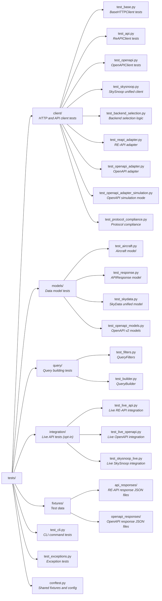

# Testing Documentation

This document describes the testing strategy and practices for the skysnoop SDK.

## Testing Philosophy

1. **Real Data**: All test fixtures use real API response data
2. **No Stubs**: Tests use complete, functional implementations
3. **Comprehensive Coverage**: Aim for >90% code coverage
4. **Fast by Default**: Mock external dependencies; live tests are opt-in
5. **Type Safety**: Tests verify type correctness

## Test Organization



## Test Types

### Unit Tests

Test individual components in isolation.

**Examples**:

- `test_aircraft.py`: Aircraft model validation
- `test_filters.py`: QueryFilters validation and serialization
- `test_builder.py`: Query string construction

**Characteristics**:

- Fast (<1ms per test)
- No external dependencies
- Test single responsibility
- Use real data structures, not mocks

### Integration Tests (Mocked)

Test component interactions with mocked external dependencies.

**Examples**:

- `test_base.py`: HTTP client with mocked httpx responses (respx)
- `test_api.py`: SkySnoop and ReAPIClient with mocked HTTP client
- `test_openapi.py`: OpenAPIClient with mocked HTTP client
- `test_cli.py`: CLI commands with mocked SkySnoop client

**Characteristics**:

- Fast (<10ms per test)
- Mock external HTTP calls with respx
- Use real API response fixtures
- Verify integration points

### Live API Tests (Opt-in)

Test against the actual adsb.lol API.

**Locations**:

- `tests/integration/test_live_api.py`: RE-API live tests
- `tests/integration/test_live_openapi.py`: OpenAPI live tests
- `tests/integration/test_skysnoop_live.py`: SkySnoop unified client live tests

**How to Run**:

```bash
# Run RE-API live tests (requires feeder access)
pytest --run-live-api

# Run OpenAPI live tests (publicly accessible)
pytest --run-live-openapi

# Run both
pytest --run-live-api --run-live-openapi
```

**Characteristics**:

- Require internet connection
- Slow (network latency)
- Marked with `@pytest.mark.live_api` or `@pytest.mark.live_openapi`
- Skipped by default
- Verify real API behavior
- Crucial for validating assumptions

**Critical Tests**:

- `test_live_comma_preservation`: Ensures commas in URLs work
- `test_live_altitude_ground_handling`: Verifies "ground" altitude handling

## Test Fixtures

### API Response Fixtures

**Location**: `tests/fixtures/api_responses/` (RE-API) and `tests/fixtures/openapi_responses/` (OpenAPI)

**RE-API Response Files**:

- `circle_multiple_aircraft.json`: Large response (198 aircraft)
- `circle_single_aircraft.json`: Single aircraft response
- `circle_zero_results.json`: Empty response
- `closest_response.json`: Closest query result
- `box_response.json`: Box query result
- `find_hex_success.json`: Successful hex lookup
- `find_hex_not_found.json`: Not found response
- `find_callsign_multiple.json`: Multiple callsign matches
- `all_with_pos_sample.json`: Bulk query sample
- `altitude_ground_example.json`: Aircraft on ground

**OpenAPI Response Files**:

- `v2_hex_single.json`: Single hex lookup response
- `v2_callsign_multiple.json`: Multiple callsign matches
- Various other v2 endpoint responses

**How to Create New Fixtures**:

```bash
# Query live API and save response
curl "https://re-api.adsb.lol?circle=37.7749,-122.4194,200" > tests/fixtures/api_responses/new_fixture.json
```

### Shared Fixtures

**Location**: `tests/conftest.py`

**Fixtures**:

- `load_api_response(filename)`: Loads JSON fixture as dict
- `skydata_response`: SkyData with 2 aircraft (unified model)
- `empty_skydata_response`: SkyData with 0 aircraft
- `single_skydata_response`: SkyData with 1 aircraft
- `mock_aircraft`: Factory for creating Aircraft instances
- `mock_skydata`: Factory for creating SkyData instances
- Pytest configuration for live API tests

## Testing Patterns

### Testing Pydantic Models

```python
def test_aircraft_minimal():
    """Test Aircraft with only required field."""
    data = {"hex": "a12345"}
    aircraft = Aircraft(**data)

    assert aircraft.hex == "a12345"
    assert aircraft.flight is None
    # Verify defaults
```

**Best Practices**:

- Test minimum required fields
- Test complete valid data
- Test validation failures
- Test forward compatibility (extra fields)
- Use real API data when possible

### Testing with Mocked HTTP (respx)

```python
@respx.mock
async def test_client_get_success(circle_response_data):
    """Test successful HTTP request."""
    base_url = "https://re-api.adsb.lol"
    query = "circle=37.7749,-122.4194,200"

    # Mock the HTTP response
    respx.get(f"{base_url}?{query}").mock(
        return_value=httpx.Response(200, json=circle_response_data)
    )

    # Execute test
    async with BaseHTTPClient(base_url=base_url) as client:
        response = await client.get(query)
        assert isinstance(response, APIResponse)
```

**Best Practices**:

- Use `@respx.mock` decorator
- Mock exact URLs with query strings
- Use real response data from fixtures
- Test both success and error cases

### Testing CLI Commands (Typer)

```python
from typer.testing import CliRunner

runner = CliRunner()

@patch("skysnoop.cli.SkySnoop")
def test_circle_command_table_output(mock_client_class, skydata_response):
    """Test circle command with table output."""
    mock_client = AsyncMock()
    mock_client.get_in_circle.return_value = skydata_response
    mock_client.__aenter__.return_value = mock_client
    mock_client.__aexit__.return_value = None
    mock_client_class.return_value = mock_client

    result = runner.invoke(app, ["circle", "--", "37.7749", "-122.4194", "200"])

    assert result.exit_code == 0
    assert "Found" in result.stdout
    mock_client.get_in_circle.assert_called_once()
```

**Best Practices**:

- Use `CliRunner` from typer.testing
- Mock `SkySnoop` client (high-level unified client)
- Use `AsyncMock` for async methods
- Use `SkyData` response fixtures (`skydata_response`, `single_skydata_response`, etc.)
- Verify command output
- Test both table and JSON output
- Test backend selection with `--backend` option

### Testing Error Handling

```python
@respx.mock
async def test_client_get_http_error():
    """Test handling of HTTP errors."""
    base_url = "https://re-api.adsb.lol"
    respx.get(f"{base_url}?circle=1,2,3").mock(
        return_value=httpx.Response(400, text="Bad Request")
    )

    async with BaseHTTPClient(base_url=base_url) as client:
        with pytest.raises(APIError, match="400"):
            await client.get("circle=1,2,3")
```

**Best Practices**:

- Test all exception types
- Verify exception messages
- Use `pytest.raises` context manager
- Test error translation (httpx → custom exceptions)

## Running Tests

### All Tests

```bash
pytest
```

### Specific Test File

```bash
pytest tests/client/test_api.py
```

### Specific Test

```bash
pytest tests/client/test_api.py::test_circle_query
```

### With Coverage

```bash
pytest --cov=skysnoop --cov-report=term-missing

# Or use the makefile
make pytest
```

### With Verbose Output

```bash
pytest -v
```

### Live API Tests

```bash
# RE-API tests (requires feeder access)
pytest --run-live-api

# OpenAPI tests (publicly accessible)
pytest --run-live-openapi

# Both
pytest --run-live-api --run-live-openapi

# Or use the makefile for RE-API tests
make pytest_live
```

### Markers

```bash
# Run only RE-API live tests
pytest -m live_api --run-live-api

# Run only OpenAPI live tests
pytest -m live_openapi --run-live-openapi

# Run everything except live API tests
pytest -m "not live_api and not live_openapi"
```

## Coverage Requirements

- **Target**: >90% code coverage
- **Critical Paths**: 100% coverage
  - Exception handling
  - Query building
  - Data model validation

**Check Coverage**:

```bash
pytest --cov=skysnoop --cov-report=html
open htmlcov/index.html
```

## Test Data Management

### Creating Test Fixtures

1. **Query Live API**:

   ```bash
   curl "https://re-api.adsb.lol?circle=37.7749,-122.4194,200" | python -m json.tool > tests/fixtures/api_responses/new_fixture.json
   ```

2. **Verify Data**:

   ```python
   import json
   with open("tests/fixtures/api_responses/new_fixture.json") as f:
       data = json.load(f)
   print(f"Aircraft count: {data['resultCount']}")
   ```

3. **Use in Tests**:

   ```python
   @pytest.fixture
   def new_fixture_data(api_responses_dir):
       with open(api_responses_dir / "new_fixture.json") as f:
           return json.load(f)
   ```

### Updating Test Fixtures

When the API changes:

1. Re-capture live API responses
2. Update fixtures in `tests/fixtures/api_responses/`
3. Run tests to identify breaking changes
4. Update models if needed (Pydantic's forward compatibility helps)

## Continuous Integration

Tests should run on:

- Every commit
- Every pull request
- Before release

**Recommended CI Configuration**:

```yaml
test:
  runs-on: ubuntu-latest
  steps:
    - uses: actions/checkout@v2
    - uses: actions/setup-python@v2
      with:
        python-version: '3.10'
    - run: pip install -e ".[dev]"
    - run: pytest --cov=skysnoop --cov-report=xml
    - uses: codecov/codecov-action@v2  # Optional: upload coverage
```

## Test Writing Guidelines

### DO

- ✅ Use real API response data
- ✅ Test edge cases (empty results, "ground" altitude, etc.)
- ✅ Test error conditions
- ✅ Keep tests focused on one thing
- ✅ Use descriptive test names
- ✅ Add docstrings to complex tests
- ✅ Verify types, not just values

### DON'T

- ❌ Use hardcoded mock values
- ❌ Test implementation details
- ❌ Depend on test execution order
- ❌ Leave broken tests
- ❌ Skip tests without reason
- ❌ Test external API directly (except live_api tests)

## Common Test Scenarios

### Testing Comma Preservation

Critical test to ensure commas aren't URL-encoded:

```python
@respx.mock
async def test_client_get_preserves_commas():
    """Test that commas in query strings are not URL-encoded."""
    base_url = "https://re-api.adsb.lol"
    query = "circle=37.7749,-122.4194,200"

    route = respx.get(f"{base_url}?{query}").mock(
        return_value=httpx.Response(200, json={...})
    )

    async with BaseHTTPClient(base_url=base_url) as client:
        await client.get(query)

    # Verify commas are NOT encoded
    assert route.called
    assert "," in str(route.calls[0].request.url)
    assert "%2C" not in str(route.calls[0].request.url)
```

### Testing "Ground" Altitude

Special case where altitude is the string "ground":

```python
def test_aircraft_altitude_ground():
    """Test aircraft with 'ground' altitude."""
    data = {
        "hex": "a12345",
        "alt_baro": "ground"
    }
    aircraft = Aircraft(**data)

    assert aircraft.alt_baro == "ground"
    assert isinstance(aircraft.alt_baro, str)
```

### Testing Filter Validation

```python
def test_query_filters_altitude_invalid_range():
    """Test that altitude range validation works."""
    with pytest.raises(ValidationError, match="above_alt_baro.*must be less than"):
        QueryFilters(above_alt_baro=40000, below_alt_baro=20000)
```

## Debugging Tests

### Print Captured Output

```bash
pytest -s  # Disable output capture
```

### Drop into Debugger on Failure

```bash
pytest --pdb
```

### Run Last Failed Tests

```bash
pytest --lf
```

### Show Locals on Failure

```bash
pytest -l
```

## Performance Testing

While not formally implemented, consider testing:

- Response time for large datasets
- Memory usage with many aircraft
- Concurrent request handling

**Example**:

```python
import time

async def test_large_response_performance():
    """Test handling of large responses."""
    start = time.time()

    async with SkySnoop() as client:
        response = await client.get_all()

    elapsed = time.time() - start

    # Reasonable performance expectations
    assert elapsed < 5.0
    assert response.result_count > 0
```

## Test Maintenance

- Review and update tests when API changes
- Remove obsolete tests
- Refactor common test patterns into fixtures
- Keep test dependencies minimal
- Document complex test scenarios
