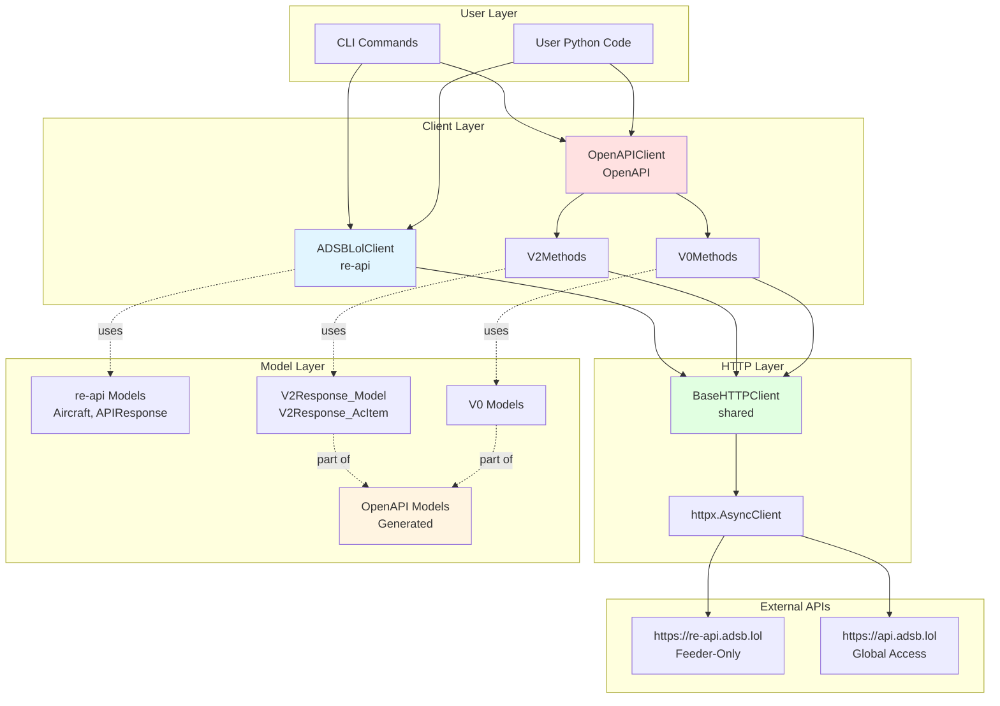
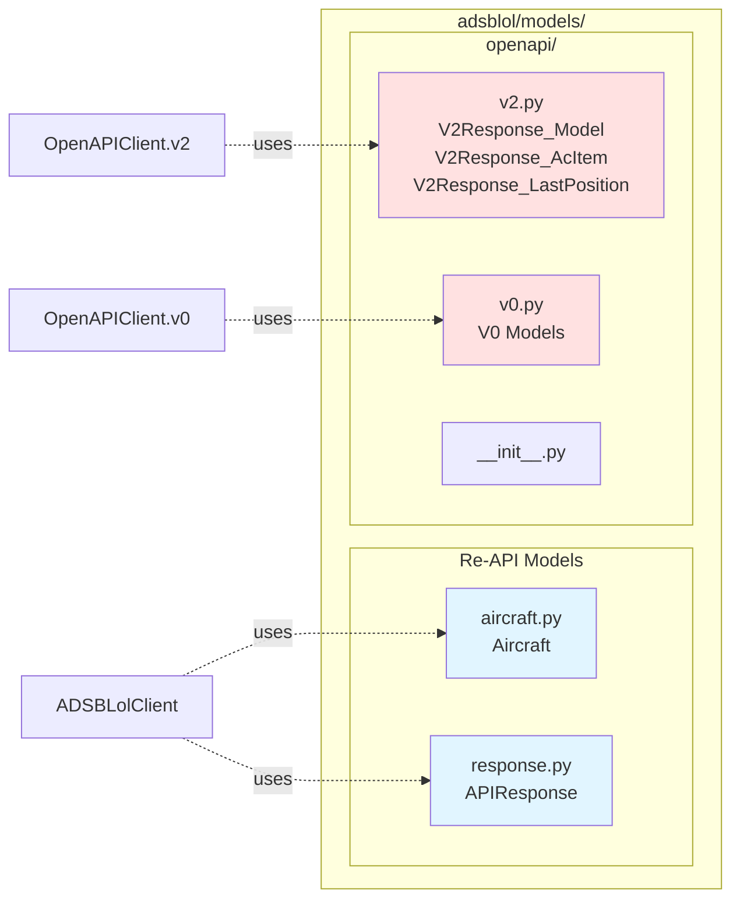
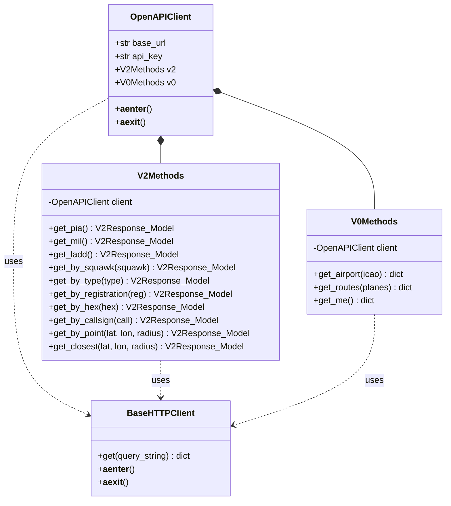
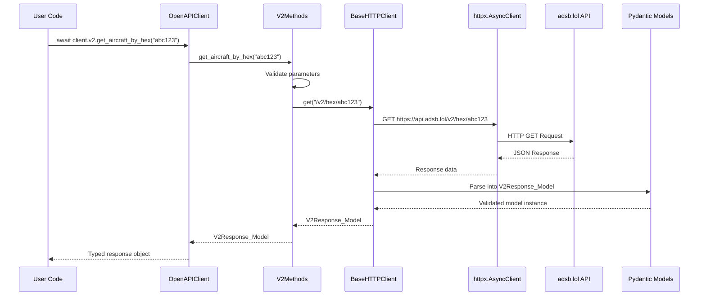
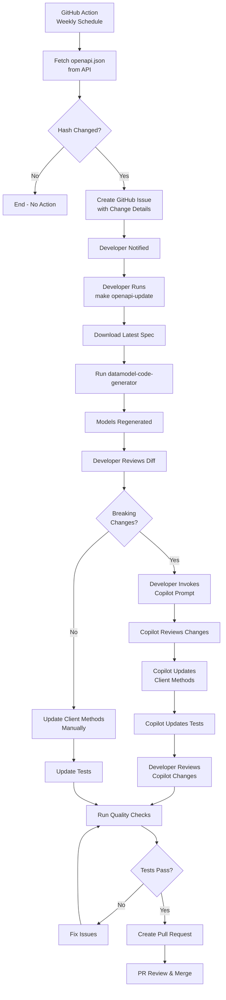
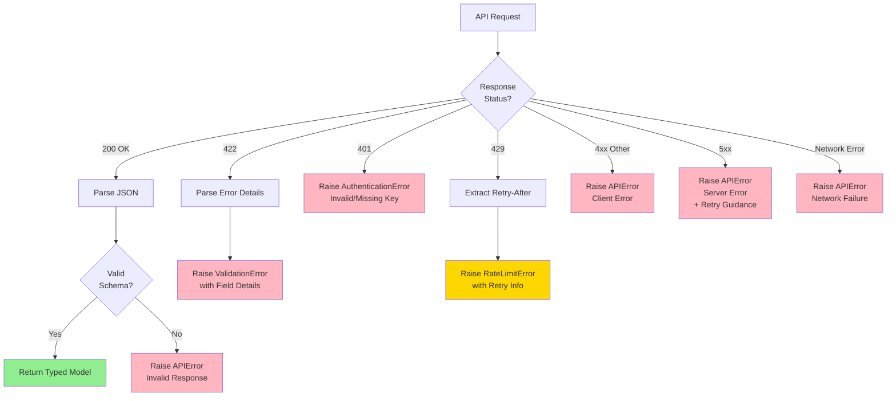

# Design: OpenAPI Client Support

## Overview

This design introduces support for the adsb.lol OpenAPI v2 and v0 endpoints alongside the existing re-api client. The implementation prioritizes automated code generation from OpenAPI schemas to minimize manual maintenance and ensure type safety.

### System Architecture



## Architecture Decisions

### Dual Client Strategy

**Decision**: Maintain separate client implementations for re-api and OpenAPI rather than creating a unified abstraction.

**Rationale**:

- Different authentication models (IP-based vs API keys)
- Different response formats and data structures
- Different use cases (re-api for feeders, OpenAPI for general use)
- Attempting to abstract would create leaky abstractions and complicate both implementations

**Implementation**:

- Keep existing `adsblol.client.api.ADSBLolClient` for re-api (unchanged)
- Add new `adsblol.client.openapi.OpenAPIClient` for OpenAPI endpoints
- Users explicitly choose which client based on their needs

### Code Generation Approach

**Decision**: Use `datamodel-code-generator` to generate Pydantic models from OpenAPI spec, with manual client methods.

**Rationale**:

- `datamodel-code-generator` generates clean Pydantic v2 models from OpenAPI schemas
- Full client generators (like `openapi-python-client`) create opinionated structure that may conflict with project conventions
- Manual client methods provide control over API design and error handling
- Generated models ensure type safety and stay synchronized with API schema

**Alternative Considered**: `openapi-python-client` - rejected due to rigid output structure and difficulty integrating with existing patterns.

### Model Organization

**Decision**: Generate OpenAPI models in `adsblol/models/openapi/` with separate modules for v0 and v2.

**Structure**:

```text
adsblol/models/
├── aircraft.py           # Existing re-api models
├── response.py           # Existing re-api models
└── openapi/
    ├── __init__.py
    ├── v2.py             # Generated v2 models
    └── v0.py             # Generated v0 models
```



**Rationale**:

- Isolates OpenAPI models from re-api models
- Version-specific modules support multiple API versions
- Clear namespace prevents confusion between API types

### Client Implementation Pattern

**Decision**: OpenAPI client follows same async context manager pattern as re-api client.

**Pattern**:

```python
async with OpenAPIClient(api_key=key) as client:
    response = await client.v2.get_aircraft_by_hex(hex="abc123")
```

**Rationale**:

- Consistency with existing ADSBLolClient API
- Proper resource cleanup via context managers
- Natural async/await syntax for users

### Versioned API Access

**Decision**: Organize methods by API version (v2, v0) rather than by operation type.

**Structure**:

```python
class OpenAPIClient:
    def __init__(self, base_url, api_key):
        self.v2 = V2Methods(self)
        self.v0 = V0Methods(self)
```



**Rationale**:

- Makes API version explicit in code
- Prevents conflicts between versions with same operation names
- Allows version-specific behavior and deprecation

### Automated Update Strategy

**Decision**: Implement multi-layered update strategy combining automation and AI assistance.

**Layers**:

1. **GitHub Action for Monitoring**: Weekly check for spec changes
   - Fetches `https://api.adsb.lol/api/openapi.json`
   - Compares hash against stored version
   - Creates issue when changes detected

2. **GitHub Action for CI Testing**: Run on every PR and push to main
   - Run unit tests with mocked responses (always)
   - Run OpenAPI live tests with `pytest --run-live-openapi`
   - Uses globally accessible API (no feeder IP required)
   - Validates OpenAPI client against real API endpoints
   - Note: re-api tests remain skipped in CI (require feeder IP)

3. **Make Target for Regeneration**: `make openapi-update`
   - Downloads latest spec
   - Runs `datamodel-code-generator`
   - Updates generated models
   - Developers run tests and update manual code as needed

4. **GitHub Copilot Prompt**: `.github/prompts/update-openapi-client.prompt.md`
   - Guides agent through update process
   - Checks for breaking changes in spec
   - Updates client methods to match new endpoints
   - Updates tests for new/changed operations

**Rationale**:

- Automation catches changes quickly
- CI tests validate OpenAPI client against real API on every change
- OpenAPI's global accessibility enables CI testing (unlike feeder-only re-api)
- Live tests in CI catch breaking changes before release
- Make target simplifies regeneration
- Copilot prompt provides guided assistance for non-mechanical changes
- Combination reduces maintenance burden while maintaining quality

### API Key Management

**Decision**: Support API keys via environment variable and parameter, with graceful handling of absence.

**Implementation**:

```python
class OpenAPIClient:
    def __init__(self, api_key: str | None = None, base_url: str = "https://api.adsb.lol"):
        self.api_key = api_key or os.getenv("ADSBLOL_API_KEY")
        # No warning logged - API keys not required yet
```

**Rationale**:

- API keys not yet required but planned for future
- No warning to avoid annoying users until keys are actually required
- Environment variable follows 12-factor app principles
- Optional parameter supports explicit configuration
- When keys become mandatory, client will raise error on requests, not on initialization

## Data Flow

### OpenAPI Client Request Flow



### Update Flow



## Error Handling

### API Errors

- 422 Validation Errors: Parse error details from response, raise `ValidationError` with field-level details
- 4xx Client Errors: Raise `APIError` with status code and message
- 5xx Server Errors: Raise `APIError` with retry guidance
- Network Errors: Raise `APIError` wrapping underlying httpx exception



### Version Compatibility

- Store API version from spec in generated code
- Log warning if spec version changes unexpectedly
- Include version in error messages for debugging

## Testing Strategy

### Generated Model Tests

- Validate models parse successfully against fixtures from actual API responses
- Test serialization and deserialization round-trips
- Verify optional field handling

### Client Method Tests

- Use `respx` to mock HTTP responses
- Test each endpoint method with success and error cases
- Verify proper parameter validation
- Test async context manager lifecycle

### Integration Tests

- Optional tests against live OpenAPI (will require API key in future)
- Marked with pytest `live_openapi` marker (distinct from `live_api` for re-api)
- Run with `pytest --run-live-openapi` flag
- Can run in GitHub Actions (unlike re-api which requires feeder IP)
- Skipped by default when flag not provided
- Add new pytest configuration in `conftest.py`:
  - New `--run-live-openapi` command line option
  - New `live_openapi` marker registration
  - Skip logic similar to existing `live_api` marker
- Document in test docstring that API key will be required in future

## Migration Path for Users

### Documentation Structure

Create `docs/dev/openapi-client.md` covering:

1. When to use OpenAPI vs re-api
   - OpenAPI: General use, no feeder requirement, will require API key, globally accessible
   - re-api: Feeders only, more detailed data, IP-restricted (can't use from CI/GitHub Actions)

2. API key acquisition process
   - Sign up as feeder
   - Obtain key from adsb.lol dashboard
   - Set environment variable

3. Basic usage examples
4. Differences in data models
5. Migration guide from re-api to OpenAPI (when applicable)
6. Testing guidance
   - re-api tests: `pytest --run-live-api` (requires feeder IP, skipped in CI)
   - OpenAPI tests: `pytest --run-live-openapi` (can run anywhere, including CI)

### CLI Integration

Add new subcommands:

- `adsblol openapi` - Root command for OpenAPI operations
- `adsblol openapi v2 hex <hex>` - V2 hex lookup
- `adsblol openapi v2 circle <lat> <lon> <radius>` - V2 circle query
- Similar for v0 endpoints

Keep existing commands unchanged, operating on re-api.

## Security Considerations

### API Key Storage

- Never log API keys
- Use `SecretStr` type for keys in settings
- Recommend environment variables over command-line arguments
- Document secure key management practices

### Rate Limiting

- Implement client-side rate limiting to be respectful
- Log warnings when approaching limits
- Provide configuration for rate limit thresholds

## CI/CD Integration

### GitHub Actions Workflows

**Primary Test Workflow** (runs on PR and push to main):

```yaml
name: Tests
on: [push, pull_request]
jobs:
  test:
    steps:
      - name: Run unit tests
        run: pytest tests/ -v --cov

      - name: Run OpenAPI live tests
        run: pytest tests/integration/test_live_openapi.py -v --run-live-openapi
        # Future: add API key from secrets when required
        # env:
        #   ADSBLOL_API_KEY: ${{ secrets.ADSBLOL_API_KEY }}
```

**Spec Monitoring Workflow** (runs weekly):

```yaml
name: Check OpenAPI Spec
on:
  schedule:
    - cron: '0 0 * * 0'  # Weekly on Sunday
jobs:
  check-spec:
    steps:
      - name: Download latest spec
        run: curl -s https://api.adsb.lol/api/openapi.json > latest_spec.json

      - name: Compare with stored spec
        run: |
          if ! cmp -s latest_spec.json openapi_spec.json; then
            # Create GitHub issue with spec changes
          fi
```

**Key Points**:

- OpenAPI live tests run in CI (globally accessible)
- re-api tests remain skipped in CI (require feeder IP)
- Spec monitoring runs weekly to catch API changes
- CI validates client against real API on every change

## Maintenance Tooling

### Makefile Targets

```makefile
.PHONY: openapi-download
openapi-download:
    curl -s https://api.adsb.lol/api/openapi.json > openapi_spec.json

.PHONY: openapi-generate
openapi-generate: openapi-download
    datamodel-codegen --input openapi_spec.json \
        --output adsblol/models/openapi/ \
        --target-python-version 3.10 \
        --use-double-quotes \
        --output-model-type pydantic_v2.BaseModel

.PHONY: openapi-update
openapi-update: openapi-generate
    @echo "Models regenerated. Review changes and update client methods."
    @echo "Consider running: copilot @.github/prompts/update-openapi-client.prompt.md"
```

### Version Tracking

Store spec version and hash in `adsblol/client/openapi_version.py`:

```python
# Auto-generated - do not edit
OPENAPI_VERSION = "0.0.2"
SPEC_HASH = "abc123..."
SPEC_UPDATED = "2025-11-17"
```

This allows runtime version checks and debugging.

## Future Considerations

### API Key Requirement

When API keys become mandatory:

1. Update client to raise error if key not provided
2. Update documentation with key requirement
3. Consider migration guide for existing users
4. May need deprecation cycle for keyless operation

### Additional API Versions

If v3 or later versions are released:

1. Generate new `adsblol/models/openapi/v3.py`
2. Add `client.v3` methods
3. Maintain backward compatibility with older versions
4. Document version differences and migration paths

### Response Caching

Consider adding optional caching layer:

- Cache keyed by (endpoint, params)
- Configurable TTL (default 1 second, matching typical API cache)
- Useful for rapid successive queries
- Implementation deferred until user demand proven
