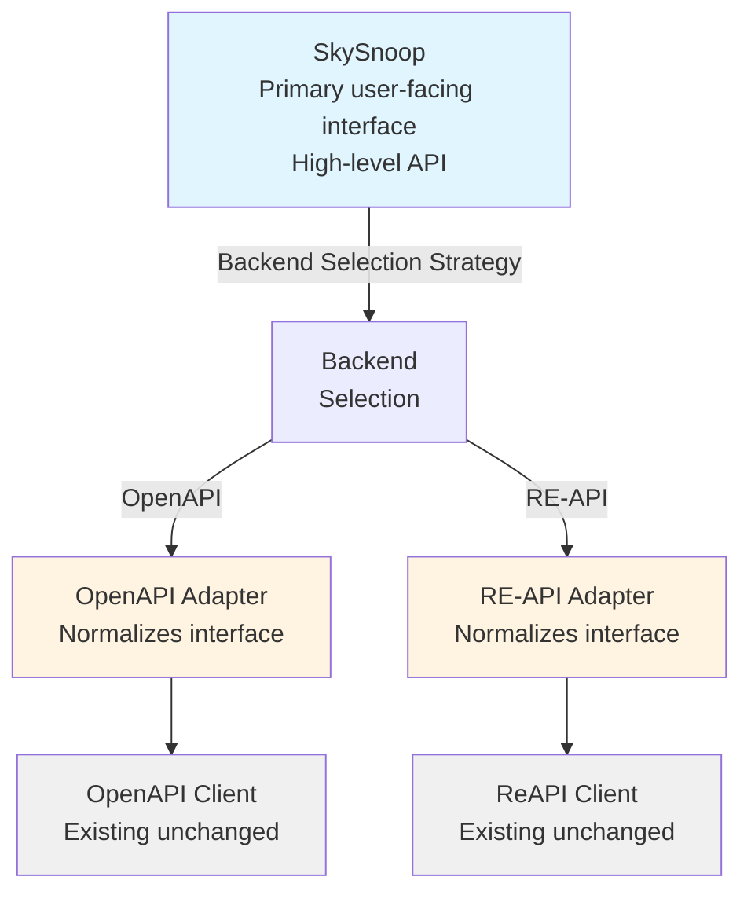

# Design Document: Unified Client Abstraction

## Overview

This design introduces a unified client abstraction layer that provides a consistent interface across both the OpenAPI and RE-API clients. The abstraction enables users to write code that works with either backend without modification, allowing seamless switching between APIs based on deployment context, access restrictions, or feature requirements.

## Problem Statement

Currently, `skysnoop` provides two distinct client implementations:

1. **ReAPIClient**: Legacy feeder-only API with IP-based access control
2. **OpenAPIClient**: Modern public API with structured v2/v0 endpoint organization

These clients have different:

- **Method signatures**: OpenAPI uses `v2.get_by_hex()` while RE-API uses `find_hex()`
- **Return types**: OpenAPI returns `V2ResponseModel`, RE-API returns `APIResponse`
- **Capability coverage**: Some features exist in only one API (e.g., `box()` queries in RE-API, `get_mil()` in OpenAPI)
- **Configuration**: Different authentication mechanisms (API keys vs IP-based)

Users must write different code depending on which API they're using, and switching between APIs requires code changes throughout their application.

## Goals

1. **Unified Interface**: Provide a single, consistent API for common operations
2. **Transparent Backend Selection**: Allow runtime or configuration-based backend selection
3. **Type Safety**: Maintain strong typing with unified response models
4. **Feature Parity Mapping**: Map equivalent operations between APIs
5. **Graceful Degradation**: Handle operations not available in selected backend
6. **Zero Breaking Changes**: Existing client code continues to work unchanged
7. **Easy Migration**: Simple path for users to adopt unified interface

## Non-Goals

- Merging the two underlying clients into a single implementation
- Removing or deprecating existing client APIs
- Implementing missing features in either backend
- Creating a new third API endpoint
- Any changes at all to the APIs, as they are managed by a third party

## Architecture

### Pattern: Adapter + Strategy

The design uses a combination of the **Adapter Pattern** (to normalize interfaces) and **Strategy Pattern** (to select backend at runtime).



### Components

#### 1. SkySnoop (Main Interface)

Primary high-level client that users interact with. Delegates to the selected backend adapter.

```python
class SkySnoop:
    def __init__(
        self,
        backend: Literal["openapi", "reapi", "auto"] = "auto",
        api_key: str | None = None,
        base_url: str | None = None,
        timeout: float = 30.0,
    ):
        """Initialize with backend selection."""

    async def get_by_hex(self, hex_code: str) -> SkyData: ...
    async def get_by_callsign(self, callsign: str) -> SkyData: ...
    async def get_by_registration(self, registration: str) -> SkyData: ...
    async def get_by_type(self, aircraft_type: str) -> SkyData: ...
    async def get_in_circle(self, lat: float, lon: float, radius: float) -> SkyData: ...
    async def get_closest(self, lat: float, lon: float, radius: float) -> SkyData: ...
```

#### 2. Backend Protocol (Interface Contract)

Defines the contract that all backend adapters must implement.

```python
from typing import Protocol

class BackendProtocol(Protocol):
    """Protocol defining the interface all backend adapters must implement."""

    async def get_by_hex(self, hex_code: str) -> SkyData: ...
    async def get_by_callsign(self, callsign: str) -> SkyData: ...
    async def get_by_registration(self, registration: str) -> SkyData: ...
    async def get_by_type(self, aircraft_type: str) -> SkyData: ...
    async def get_in_circle(self, lat: float, lon: float, radius: float, filters: QueryFilters | None) -> SkyData: ...
    async def get_closest(self, lat: float, lon: float, radius: float, filters: QueryFilters | None) -> SkyData: ...
    # ... other common methods

    async def __aenter__(self) -> "BackendProtocol": ...
    async def __aexit__(self, exc_type, exc_val, exc_tb) -> None: ...
```

#### 3. OpenAPIAdapter

Wraps OpenAPIClient to conform to the BackendProtocol.

```python
class OpenAPIAdapter:
    """Adapter for OpenAPIClient to BackendProtocol.

    Note: api_key is accepted for future compatibility but not currently required by OpenAPI.
    """

    def __init__(self, api_key: str | None = None, base_url: str | None = None, timeout: float = 30.0):
        self._client = OpenAPIClient(api_key=api_key, base_url=base_url or "https://api.adsb.lol", timeout=timeout)

    async def get_by_hex(self, hex_code: str) -> SkyData:
        v2_response = await self._client.v2.get_by_hex(hex_code)
        return self._convert_v2_response(v2_response)

    def _convert_v2_response(self, v2_response: V2ResponseModel) -> SkyData:
        """Convert V2ResponseModel to SkyData."""
        # Map fields appropriately
```

#### 4. ReAPIAdapter

Wraps ReAPIClient to conform to the BackendProtocol.

```python
class ReAPIAdapter:
    """Adapter for ReAPIClient to BackendProtocol."""

    def __init__(self, base_url: str | None = None, timeout: float = 30.0):
        self._client = ReAPIClient(base_url=base_url or "https://re-api.adsb.lol/", timeout=timeout)

    async def get_by_hex(self, hex_code: str) -> SkyData:
        api_response = await self._client.find_hex(hex_code)
        return self._convert_api_response(api_response)

    def _convert_api_response(self, api_response: APIResponse) -> SkyData:
        """Convert APIResponse to SkyData."""
        # Map fields appropriately
```

#### 5. SkyData

Common response model that normalizes differences between `APIResponse` and `V2ResponseModel`.

```python
class SkyData(BaseModel):
    """Response data model from SkySnoop queries across all backend types."""

    timestamp: float  # Normalized from 'now' (both APIs)
    result_count: int  # Normalized from 'resultCount' / 'total'
    processing_time: float | None  # Normalized from 'ptime' (RE-API only)
    aircraft: list[Aircraft]  # Common aircraft list
    backend: Literal["openapi", "reapi"]  # Which backend provided this response

    # Convenience properties matching existing patterns
    @property
    def count(self) -> int:
        return self.result_count

    @property
    def has_results(self) -> bool:
        return self.result_count > 0

    def __len__(self) -> int:
        return len(self.aircraft)

    def __iter__(self):
        return iter(self.aircraft)
```

### Method Mapping

| Unified Method | OpenAPI Method | RE-API Method |
|----------------|----------------|---------------|-------|
| `get_by_hex()` | `v2.get_by_hex()` | `find_hex()` | Direct equivalent |
| `get_by_callsign()` | `v2.get_by_callsign()` | `find_callsign()` | Direct equivalent |
| `get_by_registration()` | `v2.get_by_registration()` | `find_reg()` | Direct equivalent |
| `get_by_type()` | `v2.get_by_type()` | `find_type()` | Direct equivalent |
| `get_in_circle()` | `v2.get_by_point()` | `circle()` | Direct equivalent |
| `get_closest()` | `v2.get_closest()` | `closest()` | Direct equivalent |
| `get_in_box()` | Simulated* | `box()` | Simulated via large circle + filter |
| `get_all_with_pos()` | Simulated** | `all_with_pos()` | Simulated via large radius query |
| `get_military()` | `v2.get_mil()` | `all_with_pos(filters.military=True)` | OpenAPI native, RE-API via filter |
| `get_pia()` | `v2.get_pia()` | `all_with_pos(filters.pia=True)` | OpenAPI native, RE-API via filter |

\* Box queries simulated by calculating bounding circle, fetching data, then filtering to box bounds
\*\* All-with-pos simulated using a very large radius query (e.g., 12000 NM from center point)

### Backend Selection Strategy

The `backend="auto"` option implements intelligent selection:

1. **Check for API key**: If `api_key` provided or `ADSBLOL_API_KEY` env var set → OpenAPI
   - Note: API key is accepted for future compatibility but not currently required by OpenAPI
2. **Check RE-API availability**: Attempt connection to RE-API → if successful, use RE-API
3. **Fallback to OpenAPI**: If RE-API is not accessible → OpenAPI
4. **Explicit override**: Users can force `backend="openapi"` or `backend="reapi"`

**Rationale**: RE-API is preferred as the stable default since OpenAPI spec is not yet finalized. However, OpenAPI serves as a fallback when RE-API is not accessible. API key support exists for future OpenAPI authentication requirements.

### Error Handling

- **Feature Not Available**: Raise `UnsupportedOperationError` with message indicating which backend supports the feature
- **Backend Unavailable**: Raise `BackendConnectionError` with details
- **Unified Exceptions**: Both adapters map backend-specific exceptions to common exception types where possible

## Data Model Considerations

### Aircraft Model Compatibility

Both APIs return similar aircraft data but with some differences:

- **RE-API**: Uses `APIResponse` containing `Aircraft` models
- **OpenAPI**: Uses `V2ResponseModel` containing `V2ResponseAcItem` models

The `Aircraft` model is more comprehensive and already handles optional fields well. The unified interface will:

1. Use `Aircraft` as the common aircraft model (already widely supported)
2. Create conversion from `V2ResponseAcItem` → `Aircraft` in OpenAPIAdapter
3. Pass through `Aircraft` unchanged in ReAPIAdapter

### Response Model Fields

**RE-API (`APIResponse`):**

- `now`: float (server timestamp)
- `resultCount`: int
- `ptime`: float (processing time in ms)
- `aircraft`: list[Aircraft]

**OpenAPI (`V2ResponseModel`):**

- `now`: float (server timestamp)
- `total`: int (result count)
- `ac`: list[V2ResponseAcItem] (aircraft list)
- `ctime` / `ptime`: int (cache/processing time)

**SkySnoop (`SkyData`):**

- `timestamp`: float (normalized from `now`)
- `result_count`: int (normalized from `resultCount` / `total`)
- `processing_time`: float | None (from `ptime` or `ctime`, None if unavailable)
- `aircraft`: list[Aircraft] (normalized list)
- `backend`: Literal["openapi", "reapi"] (which backend provided this)

## Implementation Phases

### Phase 1: Core Abstraction (Minimum Viable)

- Create `BackendProtocol` defining the interface contract
- Implement `OpenAPIAdapter` with core methods
- Implement `ReAPIAdapter` with core methods
- Create `SkyData` model
- Implement `SkySnoop` with basic backend selection
- Add tests for both adapters

### Phase 2: Extended Operations

- Add support for all common query methods
- Implement filter support across both backends
- Add backend capability detection
- Implement feature availability checking

### Phase 3: CLI Integration (Optional)

- Add `--backend` flag to CLI commands
- Update CLI to use `SkySnoop` optionally
- Maintain backward compatibility with direct clients

## Testing Strategy

### Protocol-Based Testing (DRY Approach)

Since all adapters implement `BackendProtocol`, use a **shared test suite** that validates protocol compliance:

1. **Shared Protocol Test Suite**: Single test class that validates BackendProtocol implementation
   - Parameterized tests that run against all adapter implementations
   - Validates all protocol methods exist and have correct signatures
   - Tests common behavior (error handling, response types, async support)
   - Each adapter is tested with the same suite, ensuring consistent behavior

2. **Adapter-Specific Tests**: Only test implementation-specific edge cases
   - OpenAPIAdapter: V2ResponseModel conversion, simulation logic, API key handling
   - ReAPIAdapter: APIResponse conversion, native operations
   - Focus on unique aspects not covered by protocol tests

3. **SkySnoop Client Tests**: Test backend selection logic and delegation

4. **Integration Tests**: Test with real APIs when available (optional)

**Benefits**: This approach ensures all adapters behave consistently, prevents code duplication in tests, and makes adding new adapters trivial (they automatically inherit the full test suite).
5. **Error Handling Tests**: Verify exception mapping and unsupported operation handling

## Migration Path

Users can gradually adopt the unified interface:

1. **Existing code unchanged**: All current `ReAPIClient` and `OpenAPIClient` code continues to work
2. **New projects**: Start with `SkySnoop` for backend flexibility
3. **Gradual migration**: Replace specific client usage with unified interface method-by-method
4. **Full migration**: Eventually switch entire codebase to unified interface (optional)

Example migration:

```python
# Before (OpenAPI-specific)
async with OpenAPIClient() as client:
    response = await client.v2.get_by_hex("abc123")

# After (backend-agnostic)
async with SkySnoop(backend="auto") as client:
    response = await client.get_by_hex("abc123")
```

## Simulation Strategies for OpenAPI

Since OpenAPI doesn't natively support some RE-API operations, we simulate them:

### Box Query Simulation

**Problem**: OpenAPI doesn't have a box/rectangle query endpoint.

**Solution**:

1. Calculate the center point of the box: `center_lat = (lat_south + lat_north) / 2`, `center_lon = (lon_west + lon_east) / 2`
2. Calculate the radius needed to encompass the entire box (diagonal distance from center to corner)
3. Query OpenAPI with `get_by_point(center_lat, center_lon, radius)`
4. Filter results client-side to only include aircraft within the box bounds:
   - `lat_south <= aircraft.lat <= lat_north`
   - Handle longitude wrapping for boxes crossing the antimeridian
   - `lon_west <= aircraft.lon <= lon_east` (with wraparound handling)

**Trade-offs**:

- More data fetched than needed (circle contains box)
- Client-side filtering adds processing time
- Still more efficient than multiple queries
- Works for reasonable box sizes

### All With Position Simulation

**Problem**: OpenAPI doesn't have an endpoint to get all aircraft with positions.

**Solution**:

1. Use a very large radius query from a central point (e.g., 12000 NM from 0°, 0°)
2. Note in response metadata that this is simulated and may not cover entire globe
3. Consider multiple queries from different centers if needed (future enhancement)

**Trade-offs**:

- May not capture aircraft in all parts of the globe
- Single query point limits coverage
- API may have radius limits
- Still useful for general monitoring

**Note**: Document in SkyData or add a `simulated: bool` field to indicate when operations are simulated vs native.

## Open Questions

1. **Filter Compatibility**: How to handle filters that work differently between APIs?
   - **Decision**: Pass `QueryFilters` through ReAPIAdapter unchanged; ignore in OpenAPIAdapter (filters built into endpoints)

2. **Bulk Operations**: How to handle `all()` and `all_with_pos()` which don't exist in OpenAPI?
   - **Decision**: Cannot simulate due to OpenAPI's 250 NM maximum radius limit. These operations are only available with the RE-API backend. Raise `NotImplementedError` with helpful message when called with OpenAPI backend.

3. **V0 Endpoints**: Should unified interface support v0 endpoints (`get_routes()`, `get_airport()`, etc.)?
   - **Decision**: No, these are utility endpoints without RE-API equivalents; users access via `client.v0` directly

4. **Type Annotations**: Should `SkySnoop` methods be typed to return `SkyData` or use generics?
   - **Decision**: Use concrete `SkyData` type for simplicity and consistency

## Alternatives Considered

### Alternative 1: Create Third Implementation

**Rejected**: Would require maintaining three clients instead of two, and wouldn't leverage existing tested code.

### Alternative 2: Modify Existing Clients to Share Interface

**Rejected**: Would require breaking changes to existing clients, violating zero-breaking-changes goal.

### Alternative 3: Use Abstract Base Class Instead of Protocol

**Rejected**: Protocol provides better type checking without runtime overhead and doesn't require adapters to inherit.

### Alternative 4: Single Unified Response (No Aircraft Conversion)

**Rejected**: Would require users to handle different aircraft models based on backend, defeating the purpose.

## Future Enhancements

1. **Caching Layer**: Add optional caching in `SkySnoop` to reduce API calls
2. **Fallback Chain**: Automatically retry with alternative backend if primary fails
3. **Load Balancing**: Distribute requests across multiple backend instances
4. **Metrics**: Track which backend is used and performance characteristics
5. **Smart Routing**: Route specific query types to most appropriate backend based on features

## References

- [Adapter Pattern](https://refactoring.guru/design-patterns/adapter)
- [Strategy Pattern](https://refactoring.guru/design-patterns/strategy)
- [Protocol (PEP 544)](https://peps.python.org/pep-0544/)
